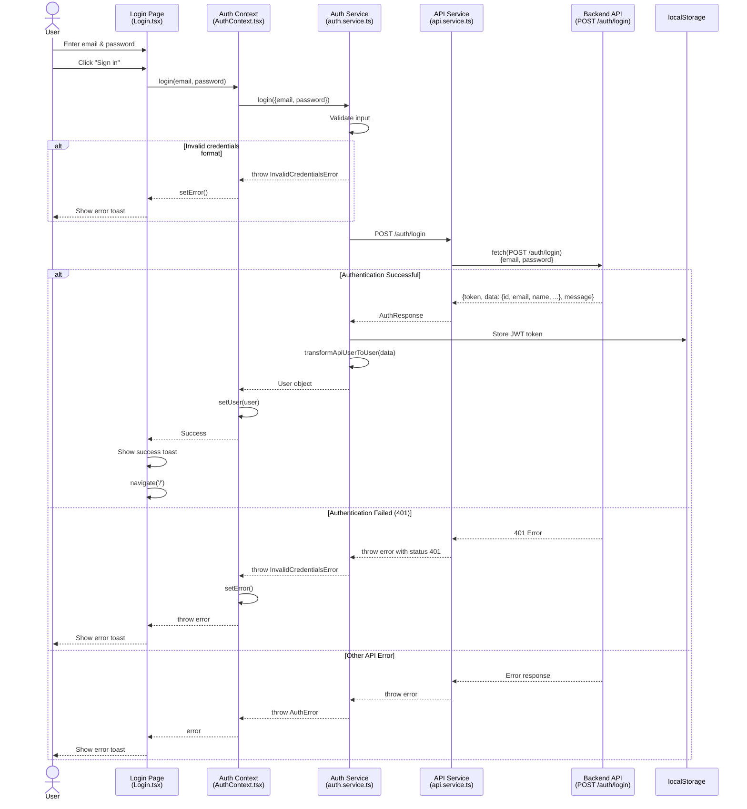
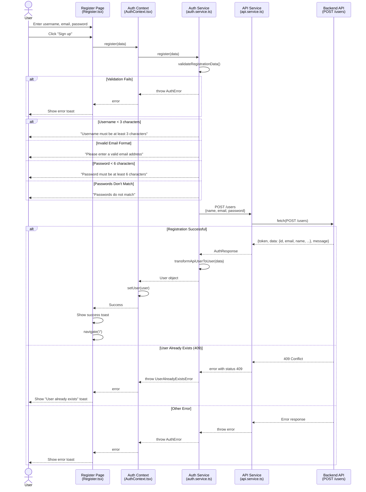
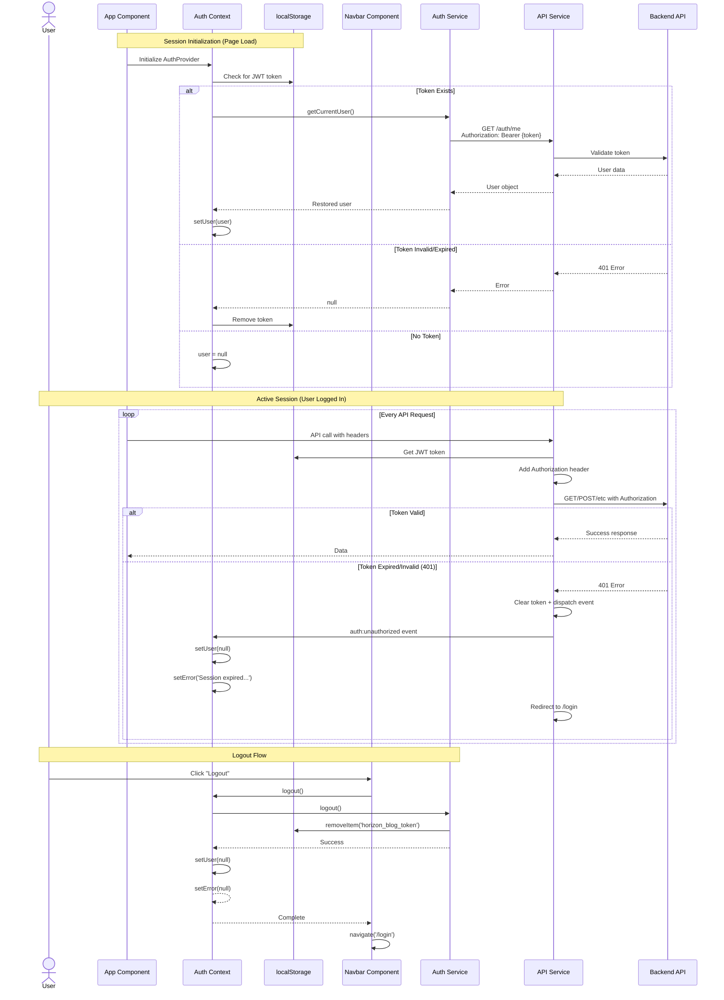
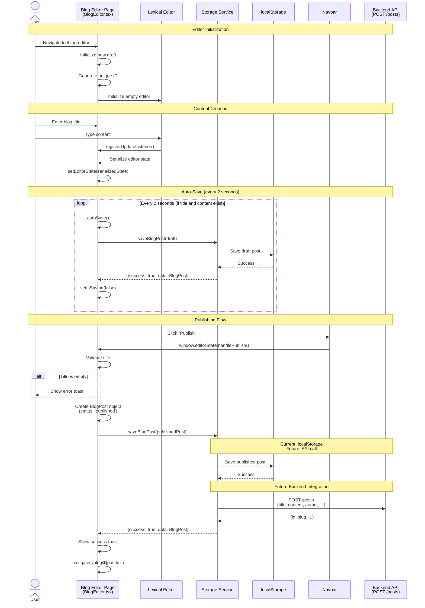
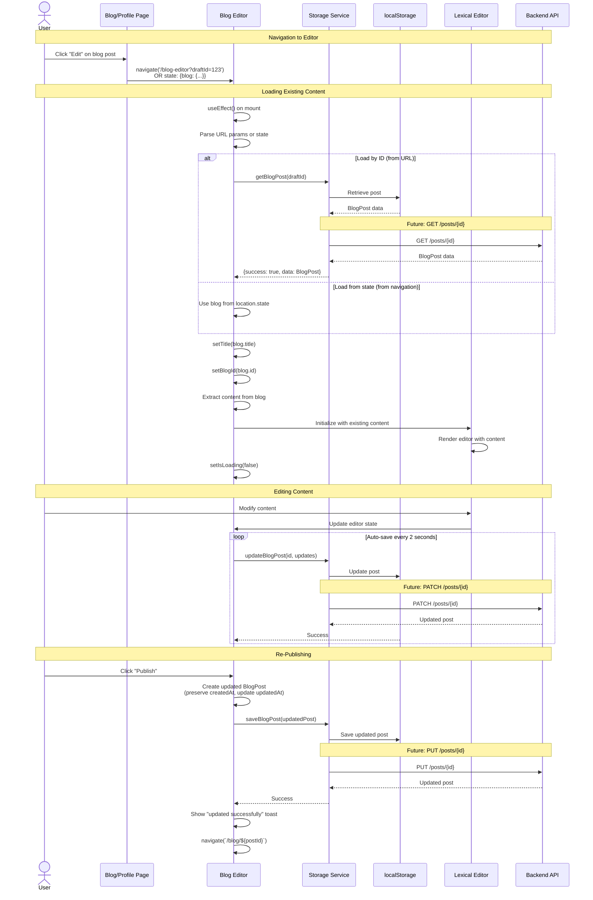
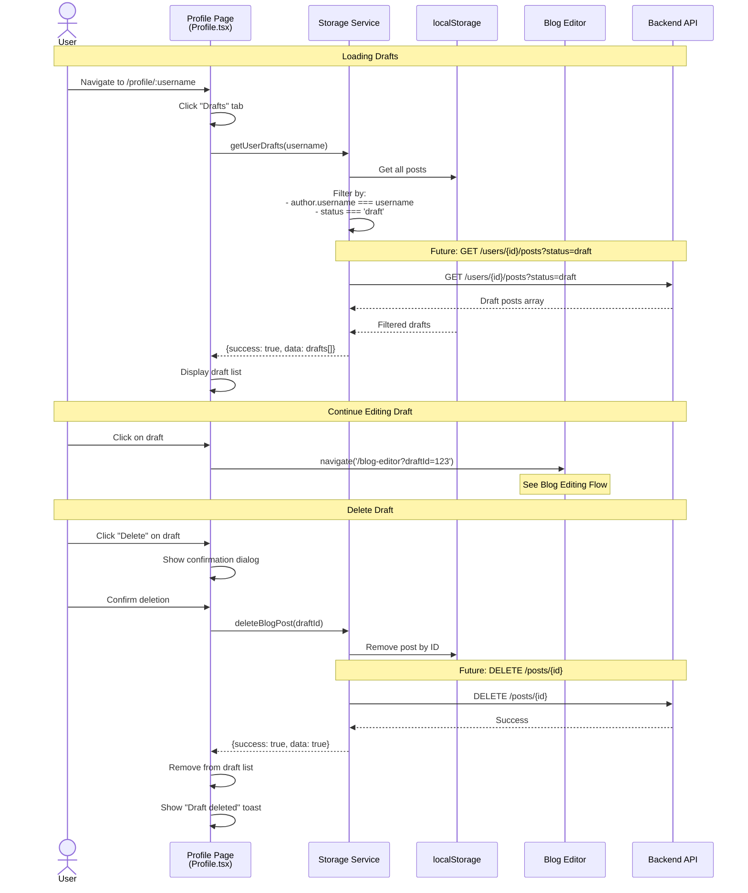
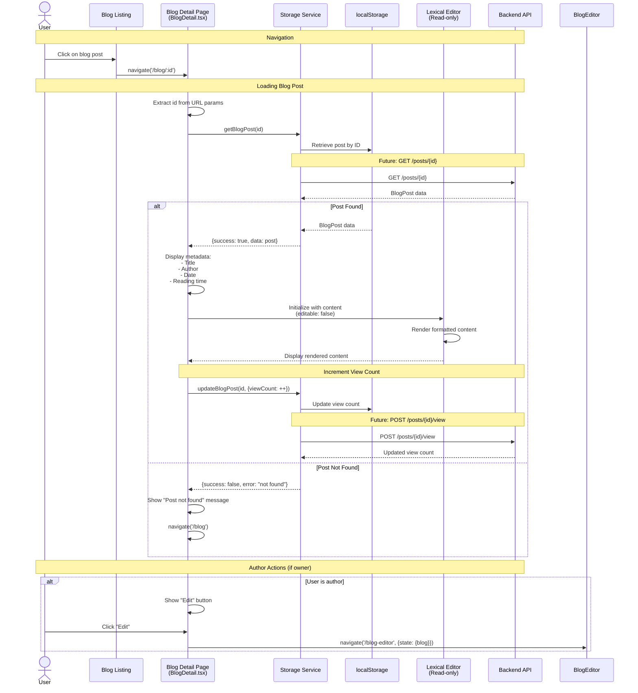
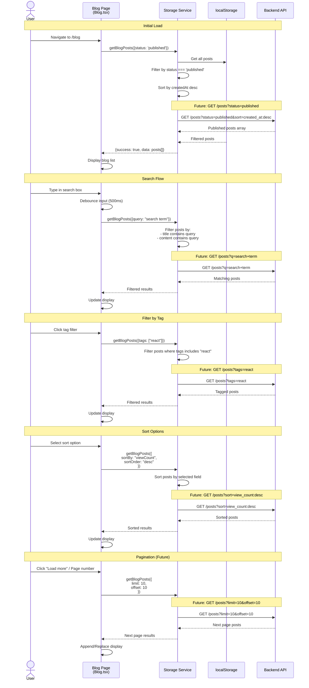
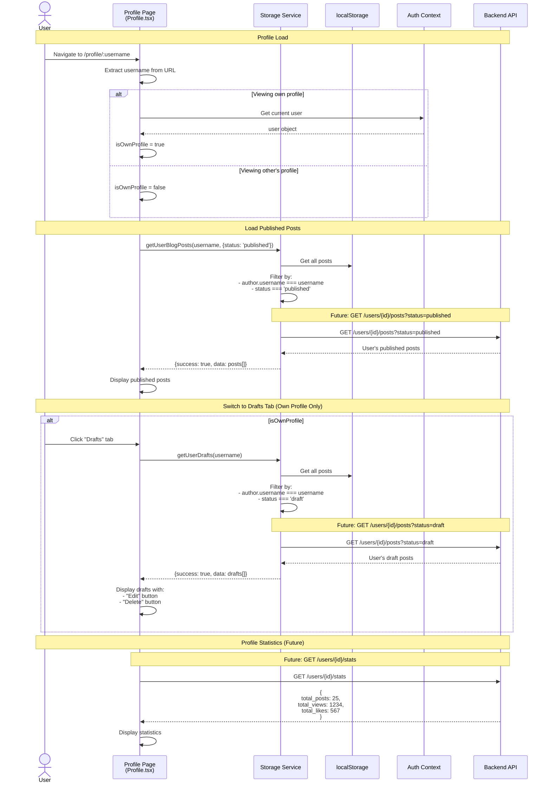
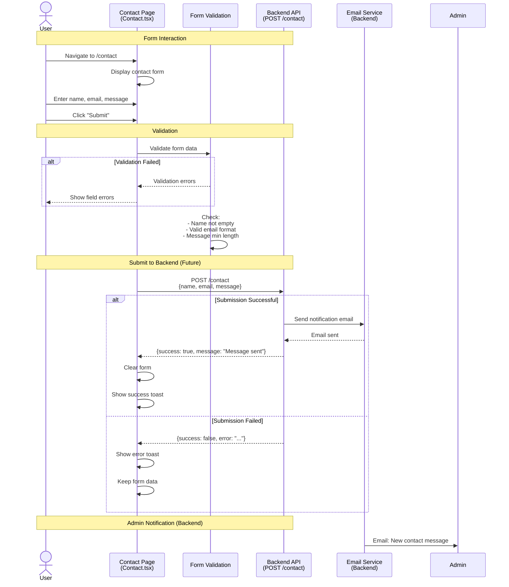

# Horizon Blog - Workflow Documentation

This document provides comprehensive documentation for all major workflows in the Horizon Blog application, including mermaid diagrams and detailed descriptions to facilitate backend integration and UIUX development.

---

## Table of Contents

1. [Authentication Flow](#1-authentication-flow)
2. [User Registration Flow](#2-user-registration-flow)
3. [Session Management Flow](#3-session-management-flow)
4. [Blog Creation & Publishing Flow](#4-blog-creation--publishing-flow)
5. [Blog Editing Flow](#5-blog-editing-flow)
6. [Draft Management Flow](#6-draft-management-flow)
7. [Blog Viewing Flow](#7-blog-viewing-flow)
8. [Blog Search & Filter Flow](#8-blog-search--filter-flow)
9. [User Profile Flow](#9-user-profile-flow)
10. [Contact Form Flow](#10-contact-form-flow)

---

## 1. Authentication Flow

### Overview
The authentication flow handles user login using email and password credentials. Upon successful authentication, the backend returns a JWT token which is stored in localStorage and used for subsequent authenticated requests.

### Key Components
- **Page**: `src/pages/Login.tsx`
- **Context**: `src/context/AuthContext.tsx`
- **Service**: `src/core/services/auth.service.ts`
- **API Service**: `src/core/services/api.service.ts`

### Workflow Diagram



### Data Flow

**Request to Backend:**
```json
POST /auth/login
Content-Type: application/json

{
  "email": "user@example.com",
  "password": "password123"
}
```

**Response from Backend:**
```json
{
  "token": "eyJhbGciOiJIUzI1NiIsInR5cCI6IkpXVCJ9...",
  "data": {
    "id": 1,
    "email": "user@example.com",
    "name": "John Doe",
    "created_at": "2024-01-01T00:00:00Z",
    "updated_at": "2024-01-01T00:00:00Z"
  },
  "message": "Login successful"
}
```

**Transformed User Object (Frontend):**
```typescript
{
  username: "John Doe",  // Mapped from API 'name'
  email: "user@example.com",
  avatar: "https://api.dicebear.com/7.x/avataaars/svg?seed=John%20Doe"
}
```

### Error Handling

| Error Type | HTTP Status | Frontend Handling |
|------------|-------------|-------------------|
| Invalid Credentials | 401 | Display "Invalid username or password" |
| Network Error | - | Display "Login failed. Please try again." |
| Validation Error | - | Display specific validation message |
| Server Error | 500 | Display "Login failed. Please try again." |

### Storage

- **JWT Token**: Stored in `localStorage` with key `horizon_blog_token`
- **User Object**: Stored in React Context (memory only)

---

## 2. User Registration Flow

### Overview
New users can register by providing username, email, and password. The frontend validates input and sends registration data to the backend. Upon successful registration, the user is automatically logged in.

### Key Components
- **Page**: `src/pages/Register.tsx`
- **Context**: `src/context/AuthContext.tsx`
- **Service**: `src/core/services/auth.service.ts`
- **API Service**: `src/core/services/api.service.ts`

### Workflow Diagram



### Data Flow

**Request to Backend:**
```json
POST /users
Content-Type: application/json

{
  "name": "John Doe",
  "email": "john@example.com",
  "password": "password123"
}
```

**Response from Backend:**
```json
{
  "token": "eyJhbGciOiJIUzI1NiIsInR5cCI6IkpXVCJ9...",
  "data": {
    "id": 1,
    "email": "john@example.com",
    "name": "John Doe",
    "created_at": "2024-01-01T00:00:00Z",
    "updated_at": "2024-01-01T00:00:00Z"
  },
  "message": "User created successfully"
}
```

### Validation Rules

| Field | Rule | Error Message |
|-------|------|---------------|
| Username | Min 3 characters | "Username must be at least 3 characters long" |
| Email | Valid email format | "Please enter a valid email address" |
| Password | Min 6 characters | "Password must be at least 6 characters long" |
| Confirm Password | Match password | "Passwords do not match" |

---

## 3. Session Management Flow

### Overview
Session management handles maintaining user authentication state across page refreshes and managing logout. Uses JWT token stored in localStorage with Authorization headers for API requests.

### Key Components
- **Context**: `src/context/AuthContext.tsx`
- **Service**: `src/core/services/auth.service.ts`
- **Layout**: `src/components/layout/Navbar.tsx`

### Workflow Diagram



### Session Storage

**Current Implementation:**
- JWT token stored in `localStorage` with key `horizon_blog_token`
- User object stored in React Context (memory)
- Session restored on page refresh using `GET /auth/me` endpoint
- API requests include `Authorization: Bearer {token}` headers
- Automatic logout on expired/invalid tokens (401 responses)

---

## 4. Blog Creation & Publishing Flow

### Overview
Authenticated users can create and publish blog posts using the Lexical rich text editor. The editor supports auto-save to drafts and manual publishing.

### Key Components
- **Page**: `src/pages/BlogEditor.tsx`
- **Service**: `src/core/services/storage.service.ts`
- **Utils**: `src/core/utils/blog.utils.ts`
- **Editor**: `@lexical/react` (Lexical Editor)

### Workflow Diagram



### Data Flow

**Blog Post Object Structure:**
```typescript
{
  id: "generated_id",
  title: "My Blog Post",
  content: {
    blocks: {
      root: {
        children: [...], // Lexical nodes
        direction: "ltr",
        format: "",
        indent: 0,
        type: "root",
        version: 1
      }
    }
  },
  author: {
    username: "John Doe",
    avatar: "https://api.dicebear.com/7.x/avataaars/svg?seed=John%20Doe"
  },
  createdAt: "2024-01-01T00:00:00.000Z",
  updatedAt: "2024-01-01T00:00:00.000Z",
  status: "published", // or "draft"
  readingTime: 5,
  slug: "my-blog-post",
  viewCount: 0,
  likeCount: 0
}
```

**Backend API Request (Future):**
```json
POST /posts
Content-Type: application/json
Authorization: Bearer <jwt_token>

{
  "title": "My Blog Post",
  "content": {
    "blocks": {...}
  },
  "status": "published",
  "slug": "my-blog-post"
}
```

**Backend API Response (Expected):**
```json
{
  "id": 123,
  "title": "My Blog Post",
  "content": {...},
  "author": {
    "id": 1,
    "name": "John Doe",
    "email": "john@example.com"
  },
  "slug": "my-blog-post",
  "status": "published",
  "created_at": "2024-01-01T00:00:00Z",
  "updated_at": "2024-01-01T00:00:00Z"
}
```

### Auto-Save Behavior

- **Trigger**: Content or title changes
- **Delay**: 2 seconds after last change
- **Condition**: Both title and content must exist
- **Status**: Saves as "draft"
- **Feedback**: Shows "Saving..." indicator

---

## 5. Blog Editing Flow

### Overview
Users can edit their existing blog posts (both drafts and published). The editor loads existing content and allows modifications.

### Key Components
- **Page**: `src/pages/BlogEditor.tsx`
- **Service**: `src/core/services/storage.service.ts`

### Workflow Diagram



### URL Parameters

| Parameter | Description | Example |
|-----------|-------------|---------|
| `draftId` | ID of the blog post to edit | `/blog-editor?draftId=abc123` |

### State Navigation

```typescript
navigate('/blog-editor', {
  state: {
    blog: blogPostObject
  }
});
```

---

## 6. Draft Management Flow

### Overview
Users can view and manage their draft blog posts from their profile page.

### Key Components
- **Page**: `src/pages/Profile.tsx`
- **Service**: `src/core/services/storage.service.ts`

### Workflow Diagram



---

## 7. Blog Viewing Flow

### Overview
Users can view published blog posts with rendered content from the Lexical editor.

### Key Components
- **Page**: `src/pages/BlogDetail.tsx`
- **Service**: `src/core/services/storage.service.ts`

### Workflow Diagram



### Content Rendering

The blog detail page uses the Lexical editor in read-only mode to render rich text content with proper formatting:
- Headings (H1, H2, H3)
- Paragraphs
- Lists (ordered/unordered)
- Quotes
- Bold, italic, underline, strikethrough
- Links

---

## 8. Blog Search & Filter Flow

### Overview
Users can search and filter blog posts on the blog listing page.

### Key Components
- **Page**: `src/pages/Blog.tsx`
- **Service**: `src/core/services/storage.service.ts`

### Workflow Diagram



### Search Options Interface

```typescript
interface BlogSearchOptions {
  query?: string;           // Text search
  author?: string;          // Filter by author username
  tags?: string[];          // Filter by tags
  status?: BlogStatus;      // Filter by status (draft/published)
  sortBy?: 'createdAt' | 'updatedAt' | 'title' | 'viewCount' | 'author';
  sortOrder?: 'asc' | 'desc';
  limit?: number;           // Pagination limit
  offset?: number;          // Pagination offset
}
```

### Backend API Recommendations

```
GET /posts?q={query}&tags={tag1,tag2}&sort={field}:{order}&limit={n}&offset={m}

Examples:
- GET /posts?q=react&tags=javascript,frontend&sort=created_at:desc&limit=10&offset=0
- GET /posts?author=john-doe&status=published&sort=view_count:desc
```

---

## 9. User Profile Flow

### Overview
Users can view their profile with published posts and drafts tabs.

### Key Components
- **Page**: `src/pages/Profile.tsx`
- **Service**: `src/core/services/storage.service.ts`

### Workflow Diagram



### Profile Data Structure

```typescript
interface UserProfile {
  username: string;
  email?: string;      // Only visible to owner
  avatar: string;
  bio?: string;
  joinedDate: string;
  stats: {
    totalPosts: number;
    totalViews: number;
    totalLikes: number;
  };
}
```

---

## 10. Contact Form Flow

### Overview
Users can submit contact messages through a form. Currently stores locally but should send to backend.

### Key Components
- **Page**: `src/pages/Contact.tsx`

### Workflow Diagram



### Contact Form Data

**Request Structure:**
```json
POST /contact
Content-Type: application/json

{
  "name": "John Doe",
  "email": "john@example.com",
  "subject": "Question about services",
  "message": "I would like to know more about..."
}
```

**Response Structure:**
```json
{
  "success": true,
  "message": "Thank you for your message. We'll get back to you soon!",
  "id": 123
}
```

---

## Summary of Backend API Endpoints Needed

### Authentication Endpoints
| Method | Endpoint | Description | Status |
|--------|----------|-------------|--------|
| POST | `/auth/login` | User login | Implemented |
| POST | `/users` | User registration | Implemented |
| GET | `/auth/me` | Get current user | Needed |
| POST | `/auth/logout` | Logout user | Needed |
| POST | `/auth/refresh` | Refresh token | Needed |

### Blog Post Endpoints
| Method | Endpoint | Description | Status |
|--------|----------|-------------|--------|
| GET | `/posts` | List posts with filters | Needed |
| GET | `/posts/{id}` | Get single post | Needed |
| POST | `/posts` | Create new post | Needed |
| PUT | `/posts/{id}` | Update post | Needed |
| PATCH | `/posts/{id}` | Partial update | Needed |
| DELETE | `/posts/{id}` | Delete post | Needed |
| POST | `/posts/{id}/view` | Increment view count | Needed |
| POST | `/posts/{id}/like` | Like/unlike post | Needed |

### User Endpoints
| Method | Endpoint | Description | Status |
|--------|----------|-------------|--------|
| GET | `/users/{id}` | Get user profile | Needed |
| GET | `/users/{id}/posts` | Get user's posts | Needed |
| GET | `/users/{id}/stats` | Get user statistics | Needed |
| PATCH | `/users/{id}` | Update user profile | Needed |

### Contact Endpoint
| Method | Endpoint | Description | Status |
|--------|----------|-------------|--------|
| POST | `/contact` | Submit contact form | Needed |

---

## Frontend-Backend Data Mapping

### User Object

| Frontend Field | Backend Field | Notes |
|----------------|---------------|-------|
| `username` | `name` | Frontend uses "username" |
| `email` | `email` | - |
| `avatar` | Generated | Frontend generates from username |
| - | `id` | Backend only |
| - | `created_at` | Backend only |
| - | `updated_at` | Backend only |

### Blog Post Object

| Frontend Field | Backend Field | Notes |
|----------------|---------------|-------|
| `id` | `id` | Generated by backend |
| `title` | `title` | - |
| `content.blocks` | `content` | Lexical JSON state |
| `author.username` | `author.name` | Mapping needed |
| `author.avatar` | Generated | Frontend generates |
| `createdAt` | `created_at` | ISO 8601 format |
| `updatedAt` | `updated_at` | ISO 8601 format |
| `status` | `status` | "draft" \| "published" \| "archived" |
| `slug` | `slug` | URL-friendly identifier |
| `readingTime` | Calculated | Minutes to read |
| `viewCount` | `view_count` | Default: 0 |
| `likeCount` | `like_count` | Default: 0 |
| `tags` | `tags` | Array of strings |
| `excerpt` | `excerpt` | Short description |
| `featuredImage` | `featured_image` | Image URL |

---

## Current vs Future State

### Current Implementation (localStorage)
- All data stored in browser localStorage
- No server persistence
- Data lost when localStorage cleared
- No multi-device sync
- No authentication persistence on refresh

### Future Implementation (Backend API)
- Data persisted in database
- Multi-device sync
- Proper authentication with JWT
- Session persistence
- Real-time updates (optional)
- Analytics and metrics
- Search optimization

---

## Integration Checklist

- [ ] Implement all backend API endpoints listed above
- [ ] Update frontend services to call backend APIs instead of localStorage
- [ ] Implement JWT authentication with refresh tokens
- [ ] Add `/auth/me` endpoint for session restoration
- [ ] Transform data between frontend and backend formats
- [ ] Implement proper error handling for API calls
- [ ] Add loading states for async operations
- [ ] Implement optimistic UI updates
- [ ] Add retry logic for failed requests
- [ ] Implement request caching where appropriate
- [ ] Add analytics tracking
- [ ] Implement rate limiting on sensitive endpoints
- [ ] Add input validation on backend
- [ ] Implement file upload for featured images
- [ ] Add email notifications
- [ ] Implement search indexing
- [ ] Add pagination for large datasets

---

## Technologies Used

### Frontend
- **React 18** - UI framework
- **TypeScript** - Type safety
- **React Router DOM** - Client-side routing
- **Chakra UI** - UI component library
- **Lexical Editor** - Rich text editing
- **Context API** - State management

### Backend (Recommended)
- **Go (Golang)** - Backend language
- **Gin/Echo** - HTTP framework
- **PostgreSQL** - Database
- **JWT** - Authentication
- **Redis** - Caching (optional)

---

## Notes for Backend Development

1. **Authentication**: Implement JWT with httpOnly cookies for security
2. **Content Storage**: Store Lexical JSON as JSONB in PostgreSQL
3. **Slug Generation**: Ensure unique slugs for blog posts
4. **Search**: Implement full-text search on title and content
5. **Validation**: Validate all inputs on backend
6. **Rate Limiting**: Protect endpoints from abuse
7. **CORS**: Configure properly for frontend domain
8. **Error Responses**: Use consistent error format
9. **Pagination**: Implement cursor or offset pagination
10. **Caching**: Cache frequently accessed posts

---

This documentation provides a comprehensive overview of all workflows in the Horizon Blog application. Use it as a reference for backend integration and frontend development.
