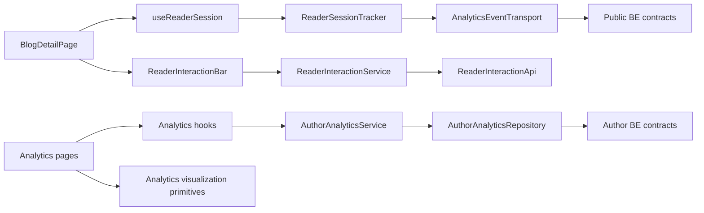
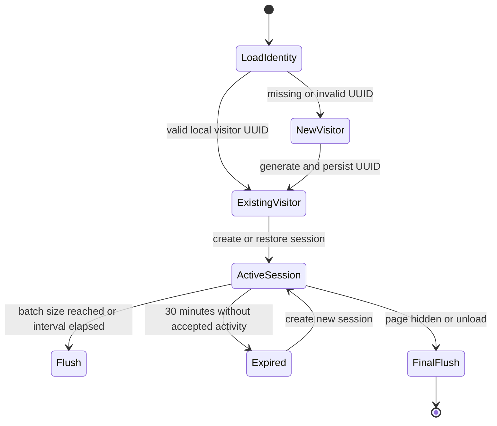
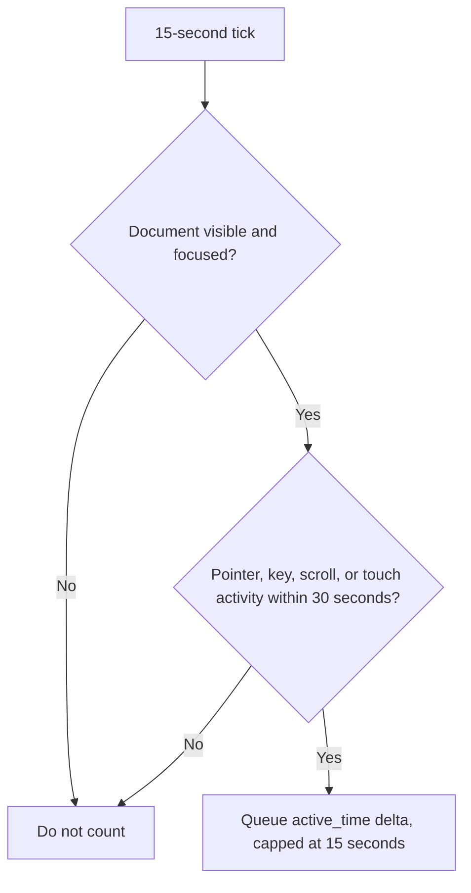
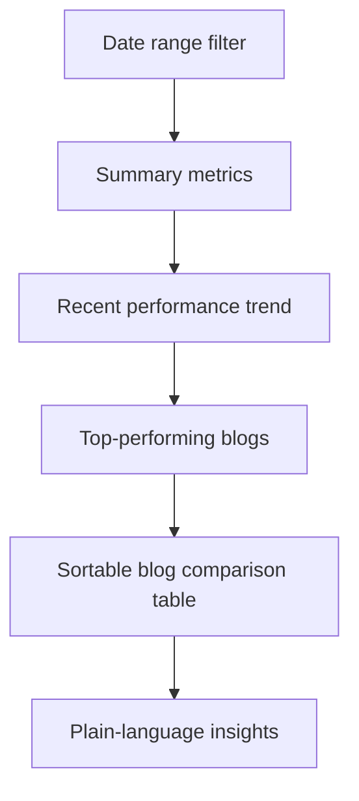
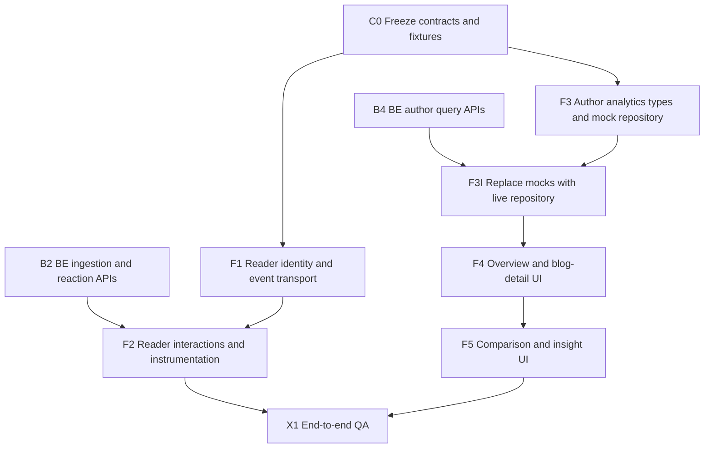

# Technical Design: Blog Interaction and Author Performance Analytics - Frontend

**Status:** Draft for review
**Date:** 2026-06-04
**Product source:** [Product Requirements Document](../../Product%20Requirements%20Document-%20Blog%20Interaction%20&%20Author%20Performance%20Analytics.pdf)
**Backend contract source:** [Backend technical design](../../horizon-blog-be/docs/blog-interaction-author-analytics-technical-design.md)

## 1. Purpose

Add lightweight reader interactions and a protected author analytics experience while preserving Horizon's calm editorial reading design and existing Clean Architecture boundaries.

The frontend has two independent feature areas:

- `reader-interactions`: first-party identity, reading-session instrumentation, heart/share controls, and non-blocking event delivery;
- `author-analytics`: owner-only overview, sortable blog metrics, blog detail, comparisons, and plain-language insights.

They share backend contracts but do not share feature state or components.

## 2. Product and UX Principles

- Reading remains the primary experience; instrumentation must be invisible and actions compact.
- Link tracking never prevents or delays navigation.
- Reader interactions work without login.
- Dashboard language explains meaning instead of exposing analytics jargon.
- The dashboard is a dedicated protected route, not embedded into the editorial profile page.
- Empty and low-data states are useful, not misleading.
- Ratios, trends, and insights always identify their date range.
- New dashboard surfaces follow semantic tokens and maintain distinct panel/card contrast.

## 3. Frontend Architecture



### Architecture Rules

- UI components do not construct API payloads.
- Hooks own request lifecycle and page orchestration.
- Services own frontend business rules and formatting.
- Repositories/API adapters own authenticated analytics requests.
- Event transport is separate from normal `apiService` because it requires batching and `fetch(..., {keepalive: true})`.
- Reader instrumentation does not import author analytics modules.
- Author analytics does not import blog repository internals.

## 4. Proposed Feature Structure

```text
src/features/reader-interactions/
  reader-interactions.types.ts
  reader-identity.storage.ts
  reader-session.service.ts
  analytics-event.transport.ts
  reader-interactions.api.ts
  reader-interactions.service.ts
  useReaderSession.ts
  useReaderInteractions.ts
  components/
    ReaderInteractionBar.tsx
    HeartButton.tsx
    ShareButton.tsx

src/features/author-analytics/
  author-analytics.types.ts
  author-analytics.repository.ts
  author-analytics.service.ts
  author-analytics.format.ts
  author-analytics.range.ts
  useAnalyticsOverview.ts
  useBlogAnalytics.ts
  useBlogMetrics.ts
  components/
    AnalyticsDateRangeFilter.tsx
    AnalyticsMetricCard.tsx
    AnalyticsTrendChart.tsx
    ReaderProgressFunnel.tsx
    BlogMetricsTable.tsx
    LinkPerformanceTable.tsx
    TrafficSourceBreakdown.tsx
    AnalyticsInsightList.tsx
  pages/
    AnalyticsOverviewPage.tsx
    BlogAnalyticsPage.tsx

src/pages/
  Analytics.tsx
  BlogAnalytics.tsx
```

Shared integration files are updated only in dedicated integration tasks:

- `src/Routes.tsx`
- `src/app/layouts/UserMenu.tsx`
- `src/core/di/container.ts`
- `src/features/blog/components/BlogReaderFrame.tsx`

## 5. Reader Identity and Session Lifecycle



### Storage

- Local storage: `horizon_blog_visitor_id`
- Session storage: per-blog reading session metadata
- Do not store event history, author analytics, raw referrers, or heart counts in persistent browser storage.
- Validate stored UUIDs before use and regenerate invalid values.

### Authentication Transition

- The frontend always sends visitor ID and session ID.
- The backend chooses authenticated identity when a valid JWT is present.
- The frontend does not merge identities or replay old anonymous events after login.

## 6. Reader Event Collection

### Session Start and View

- Start only after a published blog detail response loads successfully.
- Queue one `view_started` event for the reading session.
- Capture normalized source hints once at session start:
  - referring host;
  - allowlisted `utm_source` and `utm_medium`;
  - no arbitrary query parameters or full referrer path.

### Reading Progress

- A single `useReaderSession` hook owns scroll measurement.
- Refactor `BlogReaderFrame` to receive or expose one progress source rather than adding a second listener.
- Queue each milestone only once: `25`, `50`, `75`, `80`, `100`.
- `80` represents completion.
- Progress events are based on article content bounds, not the full page.

### Active Reading Time



- Activity listeners are passive where possible.
- Active-time tracking stops when the tab is hidden or the session expires.
- The frontend reports deltas; the backend validates and caps them.

### Link Clicks

- Attach one delegated click listener to the rendered article container.
- Identify the nearest anchor and classify it as `internal`, `external`, or explicit `cta`.
- Queue the event without calling `preventDefault`.
- Exclude generated editor controls, media URLs, unsafe schemes, and same-page hash navigation.
- Send normalized URL, visible label, kind, and rendered link position.

### Event Delivery

- Keep an in-memory queue.
- Flush every 15 seconds, at 20 queued events, and on page visibility/pagehide changes.
- Use `fetch` with `keepalive: true` for final best-effort flush.
- Retry transient failures with bounded exponential backoff during the active page session.
- Never block reading, navigation, or page teardown for analytics delivery.
- Drop permanently invalid events after logging one meaningful error.

## 7. Heart and Share Experience

### Reader Interaction Bar

The first release uses one compact inline action bar below blog metadata. It contains:

- heart toggle with visible count;
- share action;
- accessible labels and status feedback.

It must not become a floating rail, sticky overlay, or decorative distraction. A mirrored end-of-article bar is an extension, not part of the first implementation.

### Heart Behavior

- Load interaction state after blog content loads.
- Apply optimistic heart/unheart state.
- Reconcile with the backend response count.
- On failure, restore the previous state and show concise feedback.
- Disable repeated activation while one mutation is pending.
- `aria-pressed` communicates toggle state.

### Share Behavior

1. Prefer `navigator.share` when supported.
2. Fall back to copying the canonical blog URL.
3. Queue `share_completed` only after native share resolves or clipboard copy succeeds.
4. Do not count cancelled native share or clipboard failure.

## 8. Author Analytics Information Architecture

### Routes and Navigation

- `/analytics` -> protected analytics overview
- `/analytics/blog/:id` -> protected blog analytics detail
- Add `Analytics` to the authenticated `UserMenu`.
- Do not add analytics to public navigation.
- Keep profile focused on author identity and blog management.

### Overview Page



Primary content:

- total views, estimated unique readers, hearts received, shares;
- average completion and active read time;
- performance trend;
- top-performing blogs;
- sortable, paginated blog metrics;
- overview insights.

### Blog Detail Page

Primary content:

- summary metrics and freshness;
- views and engagement trend;
- reader progress funnel;
- reaction trend;
- top links with clicks and CTR;
- traffic-source breakdown with engagement quality;
- blog-specific insights.

### Visual Hierarchy

- Use one page shell on `bg.page`.
- Standard analytical panels use `bg.secondary`.
- Inset table/chart areas use `bg.tertiary` or `bg.page` so cards remain distinguishable.
- Use `action.*` for filters and interactions; reserve `accent.*` for limited atmosphere.
- Avoid a dense grid of equally weighted cards. Four primary metrics appear first; secondary metrics use a quieter row.

## 9. Date Range and Formatting

- Presets: last 7, 30, and 90 days.
- Custom date range maximum: 366 days.
- Frontend sends inclusive UTC dates matching backend contract.
- The selected range is reflected in URL query parameters for refresh/share stability.
- Ratios arrive as `0-1` decimals and are formatted as percentages.
- Durations arrive as integer seconds and use compact human-readable formatting.
- Estimated unique-reader labels explicitly say `Estimated unique readers`.

## 10. Visualization Boundary

The repository currently has no approved charting dependency.

Create feature-owned visualization components that accept typed display models:

```ts
interface TrendSeries {
  label: string
  points: Array<{ date: string; value: number }>
}
```

Feature pages depend on these components, not a chart library. Before implementing trend charts, perform a production-dependency approval gate:

- preferred option: approve one accessible, React-compatible chart library behind the visualization components;
- fallback: implement the limited line/bar/funnel set with accessible SVG and Chakra primitives.

Tables and progress funnels do not require a chart dependency. Every visual includes a textual value or accessible table equivalent.

## 11. Frontend API Boundaries

### Reader Interaction API

Consumes:

- `POST /analytics/events/batch`
- `POST /posts/{id}/interactions/state`
- `PUT /posts/{id}/interactions/heart`
- `DELETE /posts/{id}/interactions/heart`

### Author Analytics Repository

Consumes:

- `GET /users/me/analytics/overview`
- `GET /users/me/analytics/posts`
- `GET /users/me/analytics/posts/{id}`

### Contract Rules

- Types mirror approved backend DTOs and live inside the owning feature.
- No analytics fields are added to existing blog API types.
- Author repository methods return normalized repository results.
- Author service maps API DTOs to display models and owns formatting-independent business rules.
- Hooks handle loading, empty, error, and cancellation state.
- UI does not invent missing metrics or silently substitute zeros for request failures.

## 12. State and Error Handling

### Reader Interactions

| Failure | Behavior |
|---|---|
| Interaction-state load fails | Show actions without count/state emphasis; allow retry on action. |
| Heart mutation fails | Revert optimistic state and show concise feedback. |
| Event batch fails | Retry in-session; never interrupt reading. |
| Link event fails | Navigation proceeds normally. |
| Analytics tracking disabled | Heart/share actions follow backend capabilities; non-reaction events are not queued. |

### Author Analytics

| Failure | Behavior |
|---|---|
| `401` | Existing auth interceptor clears session and protected route redirects. |
| `404` blog detail | Show owner-safe not-found state. |
| Empty range | Explain that no activity was recorded in the selected range. |
| Partial/low sample | Render available metrics and cautious backend insight text. |
| `5xx` | Keep selected range, show retryable panel/page error. |
| Stale rollups | Display `data_fresh_through`; do not imply real-time precision. |

## 13. Testing and Verification

The frontend currently has no established automated test runner. The implementation plan must include an explicit approval task before adding test dependencies. Until then, pure functions should be structured for easy unit coverage and validated with TypeScript/lint plus manual scenarios.

### Required Unit-Test Targets After Test Tool Approval

- visitor/session storage and expiration
- milestone emission and one-time deduplication
- active-time eligibility
- source and link normalization
- event queue batching, retry, and final flush
- heart optimistic state and reconciliation
- date-range parsing and URL synchronization
- metric and duration formatting
- repository DTO mapping

### Component and Integration Scenarios

- anonymous heart, unheart, refresh, and visible count
- authenticated heart across sessions
- native share, copy fallback, and cancelled share
- progress milestones and idle-tab exclusion
- links navigate normally while events queue
- protected analytics routes and ownership errors
- overview sorting/filtering and empty ranges
- blog funnel, links, sources, and insights
- mobile, light/dark mode, keyboard, screen-reader labels, and reduced motion

### Required Gates

- `yarn lint`
- `yarn format`
- `yarn build` because routes, DI, shared reader behavior, and new feature modules change
- manual contract verification against backend Swagger
- manual reader and author journey verification

## 14. Delivery Plan and Dependency Control

### Dependency Graph



### Work Packages

| ID | Deliverable | Depends on | Owned paths | Must not overlap |
|---|---|---|---|---|
| F1 | Visitor/session identity, event types, queue, transport | C0 | `features/reader-interactions/` non-UI files | No blog reader edits |
| F2 | Reader session hook, heart/share UI, delegated link tracking | F1, BE B2 | `features/reader-interactions/components`, hook, reader integration | No author analytics files |
| F3 | Author analytics types, service, repository interface, approved fixtures | C0 | `features/author-analytics/` data files | No routes/pages |
| F3I | Live author analytics repository and DI registration | BE B4, F3 | repository, DI integration commit | No visual components |
| F4 | Overview/detail pages, range filter, metrics, trend/funnel/link/source UI | F3I, chart decision | analytics pages/components, route integration commit | No reader interaction files |
| F5 | Comparison and insight presentation | F4, BE B5 | focused analytics components | No contract changes |
| X1 | Cross-repo manual and automated journey verification | F2, F5 | test/QA artifacts only | No new feature scope |

### Integration-File Ownership

- `BlogReaderFrame.tsx`: F2 only, after F1 is complete.
- `Routes.tsx`: F4 route-integration commit only.
- `UserMenu.tsx`: F4 navigation-integration commit only.
- `container.ts`: F3I only.
- Analytics design-system page documentation: F4 only.

Parallel tasks must use frozen fixtures from C0. They do not import incomplete branches or edit another work package's owned paths.

## 15. Cross-Repo Delivery Sequence

1. Freeze metric glossary, event schemas, DTO examples, and acceptance fixtures.
2. Build backend schema while frontend builds identity/transport and author-data mocks.
3. Complete backend ingestion/reaction APIs, then integrate reader interactions.
4. Complete backend aggregation, then author query APIs.
5. Replace author-data mocks with live repository calls.
6. Build overview and blog-detail analytics surfaces.
7. Add deterministic insights and comparison presentation.
8. Run cross-repo QA, privacy review, staged enablement, and production-build verification.

This ordering allows safe parallelism without coupling frontend progress to unfinished backend internals.

## 16. Design-System Documentation Impact

When implementation begins:

- add `design-system/pages/analytics.md` because analytics is a distinct protected page family;
- update `design-system/pages/reader.md` with the compact interaction-bar rule;
- update `design-system/components/README.md` only for reusable analytics visualization rules;
- add semantic tokens only if repeated chart roles cannot use existing action/text/surface tokens.

The analytics UI remains author-friendly and editorial. It must not redefine Horizon as a dashboard-heavy publishing SaaS.

## 17. Future Extension Compatibility

- Multiple reactions extend interaction types and reaction-breakdown components.
- Topic analytics reuses blog tags in comparison filters.
- Export and weekly-email features consume author analytics service DTOs.
- Public reaction customization remains isolated to reader-interaction components.
- AI suggestions may render through the insight component only after a separately approved backend/privacy design.
