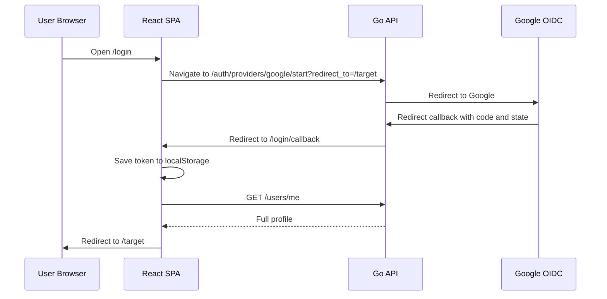

# SSO Login Plan (Frontend)

## Summary

- Keep the current React/Vite SPA auth model for v1.
- Add a Google login entry point to the existing login and registration surfaces.
- Handle the OAuth result in a dedicated callback page that stores the existing app JWT and refreshes the user profile.
- Keep the email/password path unchanged.

## Current Baseline

- Frontend stack: React, Vite, TypeScript, Chakra UI.
- Current auth flow:
  - submit email/password to `POST /auth/login`
  - store `horizon_blog_token` in `localStorage`
  - hydrate the full user state from `GET /users/me`
- Current auth state is managed in `src/context/AuthContext.tsx`.

## UI Changes

- Add a `Continue with Google` button on:
  - login page
  - register page
- Keep email/password inputs visible and unchanged.
- Preserve the current redirect behavior for protected routes by forwarding the target path into the backend `redirect_to` parameter.

## Route Changes

- Add a dedicated `/login/callback` page.
- This page should:
  - read `token` and `redirect_to` from the URL fragment
  - store `token` in the existing auth storage key
  - call the current profile refresh path
  - clear the fragment from the browser URL with `replace`
  - navigate to `redirect_to` or `/`
- If the callback contains an error or no token, route the user back to `/login` and show a clear error state.

## Frontend Flow

- User opens `/login`.
- User clicks `Continue with Google`.
- Browser navigates to `GET {BE_HOST}/auth/providers/google/start?redirect_to=<current-target>`.
- Backend completes Google auth and redirects back to:
  - `/login/callback#token=<app_jwt>&redirect_to=<path>`
- Frontend callback page:
  - stores the JWT in `localStorage`
  - refreshes `/users/me`
  - clears the fragment
  - sends the user to the original destination

## Frontend Diagram

## Auth Context Changes

- Reuse the existing storage key: `horizon_blog_token`.
- Reuse the existing `refreshUserProfile()` flow after callback success.
- Keep logout unchanged.
- Do not add a Google SDK to the frontend in v1.

## UX Notes

- The Google CTA should feel like a first-class login path, not a secondary link.
- Preserve the current `from` route behavior for protected routes.
- Show an error toast or inline error when callback parsing or profile hydration fails.
- Remove the token fragment immediately after storing the token.

## Testing

- Login page shows both password and Google paths.
- Register page shows the Google path.
- Callback page stores the token correctly.
- Callback page clears the URL fragment.
- Callback page hydrates the user profile before redirect.
- Protected-route redirect survives the full Google round trip.
- Existing email/password login still works.
- Logout still clears the stored token and auth state.

## Assumptions

- Web only for v1.
- Google is the only shipped provider in v1.
- The backend continues minting the app JWT.
- The frontend keeps the current `localStorage` token model for v1.

## Backend Dependency

This plan assumes the backend exposes:

- `GET /auth/providers/google/start?redirect_to=<relative-path>`
- `GET /auth/providers/google/callback`

and returns the existing app JWT in the callback redirect fragment.

## Sources

- [Google OpenID Connect docs](https://developers.google.com/identity/openid-connect/openid-connect)
- [OpenID Connect Core 1.0](https://openid.net/specs/openid-connect-core-1_0-18.html)
