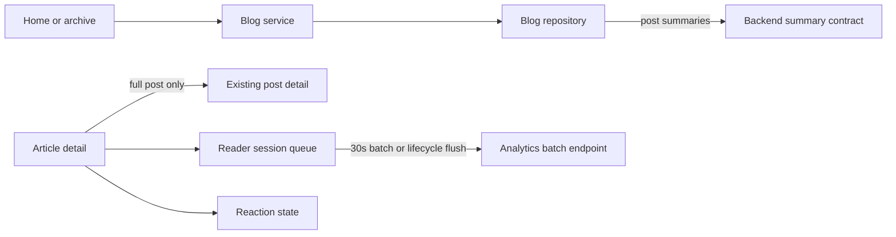

# Horizon Frontend Performance Optimization Design

**Date:** 2026-06-13
**Status:** Approved
**Backend counterpart:** `horizon-blog-be/docs/superpowers/specs/2026-06-13-performance-optimization-design.md`
**Related feature:** `specs/005-blog-interaction-analytics`

## Context

Production investigation separated frontend cost from backend tail latency:

- Static frontend median was about 218 ms and p95 below one second.
- Public API health, post detail, and reaction state exhibited multi-second p95 latency.
- Analytics increased the article route by about 12.5 KB raw and total JavaScript by about 16 KB gzip.
- The nine-post home request returned about 198 KB, mostly full markdown that summary UI discarded.

The frontend is not the primary source of multi-second stalls, but it amplifies backend pressure by requesting full listing bodies, starting two article-side requests immediately, and flushing analytics on each active-time interval or progress milestone.

## Goals

1. Consume compact post summaries for home and public archive cards.
2. Ensure article content is usable before analytics or reaction work can affect perceived loading.
3. Batch analytics delivery while preserving view, progress, active-time, click, share, and teardown semantics.
4. Keep analytics routes lazy and preserve all author-facing behavior.
5. Add no new production dependency.

## Non-Goals

- Redesigning public pages or analytics screens.
- Changing metric definitions or reaction behavior.
- Persisting an offline analytics queue.
- Adding a service worker, analytics SDK, chart library, or state library.
- Hiding backend performance failures with longer loading animations.

## Architecture

### Summary Consumption

Add a frontend API type for the backend's dedicated post-summary response. Repository and service layers map that response directly to `BlogPostSummary`; card components no longer need full markdown to compute excerpt, reading time, or cover.

Home and unfiltered public archive listing use the summary contract. Full post detail and editing paths continue using existing full-post contracts. Search remains on its existing contract unless the backend later adds an equivalent summary search response.

### Article Startup

Article detail remains the only request required to render content. Analytics session creation and reaction state start after a valid post is available, but neither controls the article loading state. Reaction errors leave the control unavailable without delaying content.

The current hooks already avoid awaiting these requests in render. Verification will preserve that boundary and remove any avoidable coupling rather than introducing duplicate page state.

### Analytics Delivery

Retain the in-memory event queue and bounded retry behavior. Separate event creation from network delivery:

- Queue `view_started` once after the post is available.
- Flush queued events on a shared delivery interval rather than once per active-time tick or progress milestone.
- Keep explicit flushes for page hide, page exit, link click, and successful share where losing the event is more likely.
- Prevent overlapping flushes so slow requests do not create concurrent write pressure.
- Preserve ordered cumulative active time and one-time progress milestones.

The default delivery interval will be 30 seconds. Tests use injected shorter intervals.

### Loading and Errors

Public content remains authoritative. Analytics and reaction failures are logged only when actionable and do not replace article content with an error state. Existing analytics dashboard loading and error states remain unchanged.

## Data Flow

## Verification

- Contract tests prove summary requests and mapping.
- Existing full-post repository and service tests remain unchanged.
- Reader-session tests prove events queue without immediate milestone/active-time requests.
- Transport tests prove only one flush can run at a time and queued events remain for retry.
- Page tests prove content renders independently from reaction and analytics responses.
- Production build comparison records main, article, and analytics route sizes.
- Production sampling records article-visible timing and API timing before and after deployment.

## Delivery Order

1. Backend publishes and tests the summary contract and optimized analytics/reaction behavior.
2. Frontend adds summary contract types and repository mapping.
3. Home and archive switch to summaries.
4. Reader analytics delivery changes to shared interval batching.
5. Cross-repo build, contract, browser, and production timing verification.
