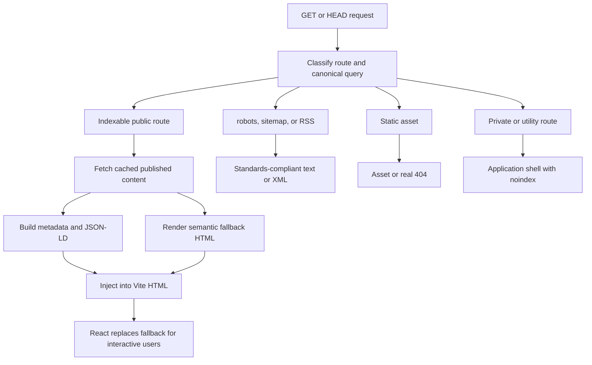

# Horizon SEO Rendering Gateway Design

**Date:** 2026-06-15
**Status:** Approved
**Approved approach:** Extend the existing production Node server while preserving React, Vite, and client-side routing.
**Feature:** `specs/007-seo-rendering-gateway`

## Context

Horizon currently provides generic site metadata and post-specific social metadata, but production verification found material search-indexing gaps:

- `/sitemap.xml` returns the application HTML instead of XML.
- `robots.txt` receives the application HTML after Cloudflare's managed directives.
- Post `og:url` can be malformed because forwarded proxy headers are not normalized.
- Public responses contain an empty React root, so article text requires JavaScript rendering.
- Canonicals, JSON-LD, route-specific metadata, explicit `noindex`, RSS discovery, and real 404 responses are absent.
- Post social images can use signed MinIO URLs that expire.
- Unknown routes and missing assets fall back to HTTP 200 application HTML.

The repository already owns a small production server in `scripts/serve-with-meta.mjs`. Extending that boundary provides crawler-readable responses without migrating frameworks or changing the interactive React application.

## Goals

1. Return useful, semantic HTML for every indexable public route.
2. Give each indexable URL accurate metadata, canonical signals, and structured data.
3. Publish valid crawler discovery resources: `robots.txt`, XML sitemap, and RSS.
4. Prevent private, authenticated, filtered, and utility routes from being indexed.
5. Return truthful HTTP status codes for missing content, missing assets, unsupported methods, and upstream outages.
6. Keep social preview images stable even when backend media URLs are signed.
7. Preserve the current React/Vite client experience and add no production dependency.

## Non-Goals

- Migrating Horizon to Next.js, Remix, or a general-purpose SSR framework.
- Changing article URLs from backend-owned identifiers to frontend-generated slugs.
- Adding analytics, advertising, keyword stuffing, generated article content, or hidden crawler-only text.
- Automating Google Search Console ownership or deployment configuration that requires external credentials.
- Redesigning public pages.

## Architecture

### Server Decomposition

Split the current server into focused ES modules under `scripts/seo/`:

- `config.mjs`: public site identity, route descriptions, cache durations, and backend hosts.
- `urls.mjs`: forwarded-header normalization, canonical URL construction, route classification, pagination, and safe URL handling.
- `content.mjs`: markdown-to-safe-semantic-HTML conversion, excerpts, reading time, and image extraction.
- `backend.mjs`: backend requests, response normalization, author resolution, and bounded metadata caches.
- `metadata.mjs`: document metadata, Open Graph, Twitter, canonical/alternate links, JSON-LD, and private-route directives.
- `render.mjs`: semantic fallback HTML for home, archive, article, author, and static public routes.
- `feeds.mjs`: XML sitemap, RSS, and robots output.
- `server.mjs`: request routing, response headers/status, static assets, and stable image proxying.

`scripts/serve-with-meta.mjs` becomes a thin executable entry point. Modules expose pure functions where possible so Vitest can verify behavior without opening a network listener.

### Route Policy

| Route family | Indexing | Server response |
| --- | --- | --- |
| `/`, `/blog`, `/about`, `/cv`, `/contact` | `index,follow` | Route metadata and semantic public content |
| `/blog/:id` | `index,follow` when published | Full article fallback, `BlogPosting`, article metadata |
| `/authors/:authorName` | `index,follow` when resolved | Author profile, published-post links, `ProfilePage` |
| Filtered/search archive URLs | `noindex,follow` | Results remain usable; canonical points to the unfiltered archive |
| Auth, editor, profile, OAuth, reset, analytics | `noindex,nofollow` | Application shell with explicit private-route directives |
| Unknown route or missing public record | none | Real 404 HTML with `noindex,nofollow` |
| Upstream required for public rendering is unavailable | none | 503 HTML, `Retry-After`, and `noindex,nofollow` |

Pagination-only archive and author URLs use self-canonicals plus `rel=prev` and `rel=next`. Invalid or out-of-range pages return 404. Query parameter order and tracking parameters never create alternate canonicals.

### Crawler-Readable HTML

Indexable responses inject semantic content into the existing `#root`:

- Home and archive: heading, introduction, article list, excerpts, dates, authors, tags, and normal anchor links.
- Article: breadcrumb navigation, title, author, dates, reading time, tags, and safely rendered markdown.
- Author: profile heading, biography, and links to published posts.
- Static public routes: route-specific heading, description, and navigational context.

The React client still calls `createRoot` and replaces the fallback with the interactive application. The fallback is ordinary user-visible HTML, not user-agent-specific dynamic rendering.

Markdown rendering uses the existing `marked` parser with a strict renderer. Raw HTML is escaped, scripts and event attributes are never emitted, unsafe URL schemes are rejected, and only semantic elements needed by article content are rendered.

### Metadata and Structured Data

Every response owns one complete head block:

- Unique title and description.
- Canonical link.
- Robots directives.
- Open Graph site name, locale, type, URL, title, description, and image.
- Twitter card metadata.
- RSS alternate link.
- Article publication/modification/author/tag metadata where applicable.
- `WebSite` and `Person` JSON-LD on public routes.
- `Blog` for the archive, `BlogPosting` plus `BreadcrumbList` for posts, and `ProfilePage` for authors.

JSON-LD values come only from data visible in the response. Serialized JSON escapes `<`, `>`, `&`, and line separators to prevent script termination.

### Stable Social Images

Post metadata points to a stable same-origin URL, `/seo/post-image/:id`. The server resolves the current backend media URL, validates the destination against allowed media hosts, streams the image, and applies bounded caching. Missing or unsafe images redirect to the permanent Horizon brand image.

This avoids placing expiring signed URLs in Open Graph, Twitter, JSON-LD, sitemap, or RSS output.

### Discovery Resources

- `robots.txt` allows public crawling, references the canonical sitemap, and leaves indexing control to per-page `noindex`.
- `sitemap.xml` contains only canonical, indexable URLs and uses backend modification timestamps for posts.
- `feed.xml` contains recent published articles with stable canonical links, descriptions, authors, publication dates, categories, and escaped content summaries.
- HTML responses advertise the RSS feed with an alternate link.

The sitemap and feed are generated from published backend records and cached briefly. Generation failures return 503 rather than application HTML.

### Caching and Failures

- Static hashed assets: one year immutable.
- Public shell/static metadata: one minute.
- Article/author metadata and fallback content: five minutes.
- Sitemap/RSS: five minutes.
- Stable image proxy: browser cache with server-side source refresh.
- 404 and private-route HTML: short cache or no-store.
- 503: no-store plus `Retry-After`.

Backend 404s stay 404. Backend 5xx/network failures become 503 for routes that require that content. A stale successful cache entry may be served during a transient upstream failure, but failures are never cached as successful content.

## Data Flow

## Security

- Escape all backend-provided text before HTML insertion.
- Render only allowlisted Markdown output.
- Reject `javascript:`, `data:`, `blob:`, and protocol-relative URLs where inappropriate.
- Prevent path traversal with resolved-path containment checks.
- Restrict image proxy hosts and response content types.
- Bound fetched payload sizes and use request timeouts.
- Do not include draft or owner-only content in HTML, sitemap, RSS, or structured data.

## Verification

- Pure unit tests cover proxy headers, canonicals, route policy, metadata escaping, JSON-LD, Markdown safety, feeds, and status mapping.
- Server integration tests use an ephemeral port and injected backend fetch behavior.
- Tests prove the former defects: malformed `og:url`, HTML sitemap, HTML robots tail, empty article root, expiring social URL, and soft 404.
- Full lint, TypeScript check, targeted Vitest, format check, and production build pass.
- Local production-server checks inspect headers and bodies for home, archive, article, author, private, missing, sitemap, RSS, robots, image, and HEAD requests.
- Browser verification confirms React takes over the semantic fallback without visible duplication or broken navigation.
- Post-deployment verification uses live `curl`, Google Rich Results Test, schema validation, PageSpeed Insights, and Search Console sitemap submission.

## Delivery Order

1. Add failing tests for route, URL, metadata, feed, and status contracts.
2. Extract pure SEO modules and make unit tests pass.
3. Add public semantic rendering and backend data adapters.
4. Add sitemap, RSS, robots, stable images, and truthful statuses.
5. Add server integration tests and preserve client takeover.
6. Run repository and local production verification.
