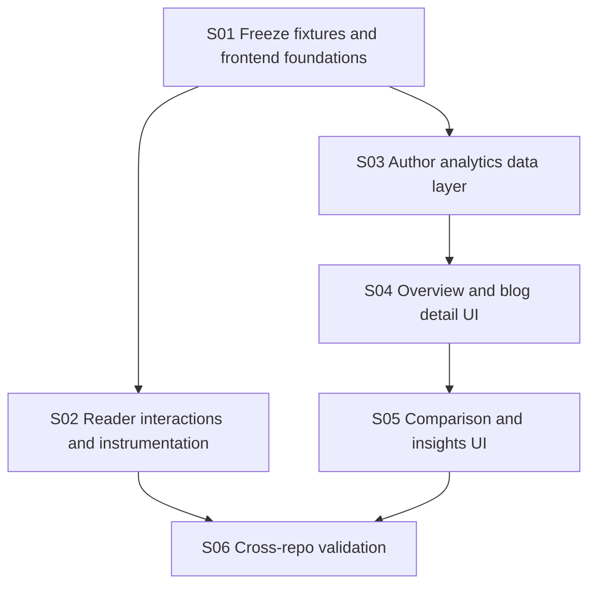

# Implementation Plan: Blog Interaction Analytics Frontend

**Branch**: `main`
**Spec**: [spec.md](./spec.md)
**Technical Design**: [frontend TD](../../docs/blog-interaction-author-analytics-technical-design.md)
**Backend Counterpart**: [backend Spec Kit pack](../../../horizon-blog-be/specs/001-blog-interaction-analytics/plan.md)
**Constitution**: [.specify/memory/constitution.md](../../.specify/memory/constitution.md)

## Technical Context

- **Stack**: React 18, TypeScript, Vite, Chakra UI, React Router, existing motion/editor utilities.
- **Architecture**: `apiService -> repository/API adapter -> service/use-case -> hook/page -> component`.
- **Feature boundaries**: separate `reader-interactions` and `author-analytics` modules.
- **Reader integration**: existing `BlogReaderFrame` and public blog detail route.
- **Author integration**: new protected analytics routes and authenticated user menu entry.
- **Visualization**: feature-owned accessible SVG/Chakra primitives; no new production dependency.
- **Validation**: lint, format, production build, contract checks, coordinated manual journeys.

## Constitution Check

- **Spec-first user value**: Pass. Reader and author outcomes, acceptance scenarios, and scope are explicit.
- **Superpowers execution discipline**: Pass. Architecture and boundaries were approved before planning.
- **Contract-aligned frontend boundaries**: Pass. Backend contracts and fixtures are authoritative.
- **Design system and accessible UI**: Pass. Analytics and reader design-system updates are explicit tasks.
- **Focused verification**: Pass. Routes, DI, shared reader behavior, and feature modules require lint, format, and build.

## Phase 0: Research

See [research.md](./research.md).

## Phase 1: Design and Contracts

- Frontend models: [data-model.md](./data-model.md)
- Backend contract consumption: [contracts/backend-api.md](./contracts/backend-api.md)
- Review journeys: [quickstart.md](./quickstart.md)
- Detailed source: [frontend TD](../../docs/blog-interaction-author-analytics-technical-design.md)

## Delivery Architecture

## Story Ownership

| Story | Primary ownership | Shared-file rule |
| --- | --- | --- |
| S01 | feature types, fixtures, identity/session/event transport foundations | No reader frame, routes, DI, or pages |
| S02 | reader hooks/components and one reader integration | Exclusively owns `BlogReaderFrame.tsx` integration |
| S03 | author repository/service/hooks and DI integration | Exclusively owns `container.ts` |
| S04 | analytics page shells, metrics, ranges, trends, funnel, routes/navigation | Exclusively owns `Routes.tsx`, `UserMenu.tsx`, and analytics design-system page |
| S05 | comparison tables and insight presentation | No contract changes or route edits |
| S06 | cross-repo QA and final validation | No new feature scope |

## Parallelism Rules

- S01 blocks reader and author feature implementation.
- S02 can run after backend public contracts exist.
- S03 can use frozen fixtures before backend author endpoints exist; live repository integration waits for backend Story 04.
- S04 starts after S03 display models stabilize.
- S05 starts after S04 page composition and backend insight DTOs stabilize.
- Every shared integration file has one owner.

## Post-Design Constitution Check

- No production dependency is added.
- Backend contracts remain authoritative.
- Reader and author feature boundaries stay independent.
- Design-system and build validation are explicit.
- Story files and tracker define reviewable commit boundaries.

