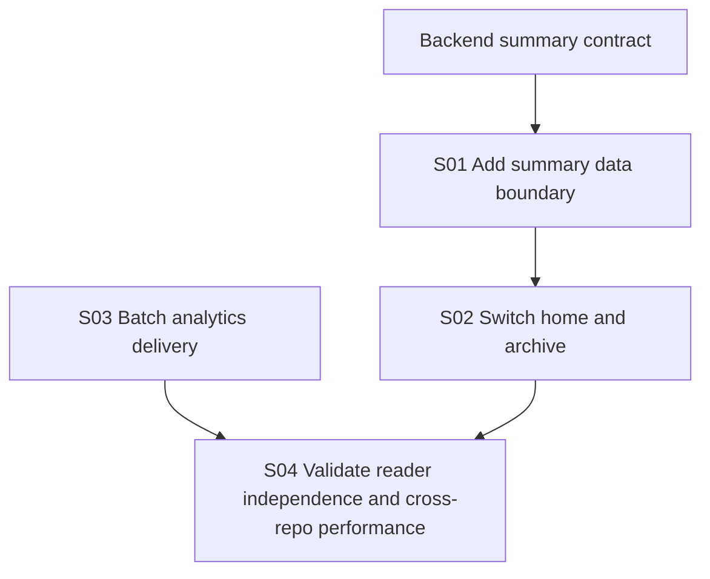

# Implementation Plan: Performance Optimization Frontend

**Branch**: `main`
**Spec**: [spec.md](./spec.md)
**Approved Design**: [performance design](../../docs/superpowers/specs/2026-06-13-performance-optimization-design.md)
**Backend Counterpart**: [backend plan](../../../horizon-blog-be/specs/002-performance-optimization/plan.md)
**Constitution**: [.specify/memory/constitution.md](../../.specify/memory/constitution.md)

## Technical Context

- **Stack**: React 18, TypeScript, Vite, Chakra UI, React Router.
- **Architecture**: `apiService -> repository/API adapter -> service/use-case -> hook/page -> component`.
- **Measured problem**: listing UI downloads about 179 KB of unused markdown and reader analytics creates avoidable routine requests.
- **Constraints**: preserve detail, editor, search, reaction, analytics, and protected-route behavior; add no production dependency.
- **Runtime**: use Node 22 fallback when the default runtime produces `EBADF`.
- **Testing**: targeted Vitest suites, lint, type check, format, justified production build, and browser verification against an owner-run target.

## Constitution Check

- **Spec-first user value**: Pass. Browsing, reading independence, event semantics, and lazy analytics outcomes are explicit.
- **Superpowers execution discipline**: Pass. Investigation and design were approved before planning.
- **Contract-aligned boundaries**: Pass. Frontend consumes the backend summary contract without inventing fields.
- **Design system and accessible UI**: Pass. Existing card and reader presentation remains unchanged.
- **Focused verification**: Pass. Repository, session, transport, component, build, and browser gates are named.

## Loaded Agent Guides

- `docs/agent-guides/workflow.md`
- `docs/agent-guides/architecture.md`
- `docs/agent-guides/domain.md`
- `docs/agent-guides/project-reference.md`

No design-system changes are planned.

## Phase 0: Research

See [research.md](./research.md).

## Phase 1: Design and Contracts

- Frontend models: [data-model.md](./data-model.md)
- Backend contract: [contracts/backend-api.md](./contracts/backend-api.md)
- Verification guide: [quickstart.md](./quickstart.md)
- Approved design: [performance design](../../docs/superpowers/specs/2026-06-13-performance-optimization-design.md)

## Delivery Architecture

## Story Ownership

| Story | Primary ownership | Shared-file rule |
| --- | --- | --- |
| S01 | summary API types, repository adapter, service contract/mapping | Exclusively owns core type/repository/service changes |
| S02 | home and unfiltered archive consumption, card summary fields | Exclusively owns home/archive hooks, pages, and listing cards |
| S03 | event transport single-flight behavior and 30-second routine batching | Exclusively owns reader session and transport modules |
| S04 | article independence tests, lazy-route/build checks, browser/performance evidence | No feature expansion; shared production files only if a failing independence test proves coupling |

## Parallelism Rules

- S01 begins only after backend Swagger publishes the summary contract.
- S02 depends on S01.
- S03 is independent and may proceed in parallel with S01/S02.
- S04 requires S02, S03, and deployed backend behavior.
- Search and full-post flows remain outside summary ownership.

## Post-Design Constitution Check

- The repository/service boundary remains intact.
- Public cards render existing information and fallbacks.
- Analytics routes remain lazy and owner requests remain absent from public routes.
- No dependency, route redesign, or new global state is introduced.
- Test-first tasks and explicit build/browser gates are recorded.
