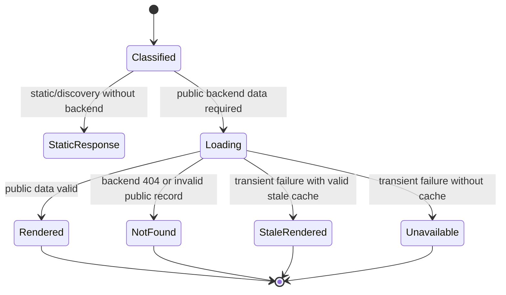

# Data Model: SEO Rendering Gateway

## RoutePolicy

Classifies one request before data loading.

| Field | Type | Rules |
| --- | --- | --- |
| `kind` | enum | `home`, `archive`, `article`, `author`, `static`, `private`, `asset`, `discovery`, `image`, `not-found` |
| `indexing` | enum | `index-follow`, `noindex-follow`, `noindex-nofollow` |
| `pathname` | string | Decoded, normalized absolute path beginning with `/` |
| `page` | integer | Positive integer; defaults to 1 only for paginated routes |
| `canonicalPath` | string | Contains only supported canonical query parameters |
| `requiresBackend` | boolean | True for article, author, archive/home content, sitemap, RSS, and post image |

## SeoDocument

Complete public document contract used to render the head and fallback body.

| Field | Type | Rules |
| --- | --- | --- |
| `status` | integer | 200, 404, or 503 for rendered HTML |
| `title` | string | Non-empty and route-specific |
| `description` | string | Plain text, bounded for snippets |
| `canonicalUrl` | absolute URL | Exactly one for indexable and duplicate public pages |
| `robots` | string | Explicit indexing policy |
| `type` | enum | `website`, `article`, or `profile` |
| `imageUrl` | absolute URL | Stable same-origin or permanent brand URL |
| `previousUrl` | absolute URL | Optional, only valid pagination |
| `nextUrl` | absolute URL | Optional, only valid pagination |
| `jsonLd` | object array | Contains only visible public facts |
| `bodyHtml` | string | Escaped semantic fallback inserted inside `#root` |
| `cacheControl` | string | Matches route volatility and failure state |

## PublishedArticle

Normalized backend record used by HTML, metadata, sitemap, RSS, and image resolution.

| Field | Type | Rules |
| --- | --- | --- |
| `id` | positive integer/string | Backend-owned canonical identifier |
| `title` | string | Required for indexable representation |
| `contentMarkdown` | string | Canonical public article body |
| `createdAt` | timestamp | Required when supplied by backend |
| `updatedAt` | timestamp | Optional; must not precede creation |
| `status` | string | Must equal `published` |
| `author` | PublicAuthor | Derived from owner/user public fields |
| `tags` | string array | Backend order retained; empty values removed |
| `sourceImage` | URL/token | Never exposed directly when signed or protected |
| `canonicalUrl` | absolute URL | `/blog/:id` |
| `stableImageUrl` | absolute URL | `/seo/post-image/:id` |

## PublicAuthor

| Field | Type | Rules |
| --- | --- | --- |
| `id` | positive integer/string | Required to fetch a public profile |
| `name` | string | Required for author index |
| `slug` | string | Lowercase ASCII route slug matching client behavior |
| `bio` | string | Optional plain text |
| `avatarUrl` | URL | Optional; not used as a persistent signed metadata URL |
| `canonicalUrl` | absolute URL | `/authors/:slug` |
| `posts` | PublishedArticle array | Only public records owned by this author |

## DiscoveryDocument

| Field | Type | Rules |
| --- | --- | --- |
| `format` | enum | `text`, `xml`, `rss` |
| `contentType` | string | Standards-appropriate MIME type with UTF-8 |
| `body` | string | Valid escaped document without application HTML |
| `generatedAt` | timestamp | Used for diagnostics, not emitted as URL modification time |
| `cacheControl` | string | Five-minute successful cache |

## StableImage

| Field | Type | Rules |
| --- | --- | --- |
| `postId` | identifier | Positive backend post identifier |
| `sourceUrl` | absolute URL | HTTPS and allowed media hostname only |
| `contentType` | string | Must begin with `image/` |
| `body` | byte stream | Bounded by configured maximum |
| `fallbackUrl` | absolute path | Permanent Horizon brand image |

## State Transitions

