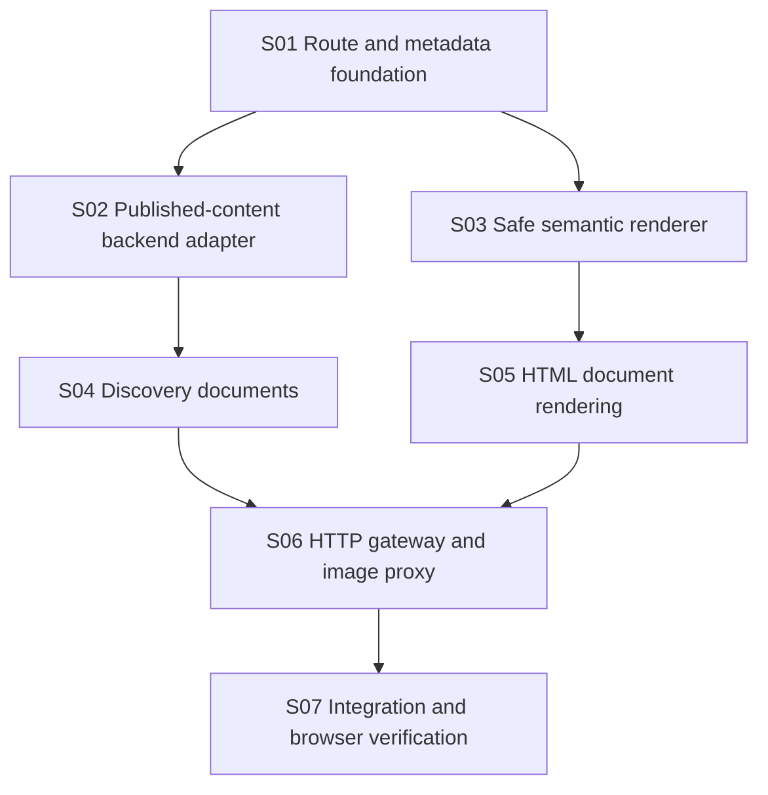

# Implementation Plan: SEO Rendering Gateway

**Branch**: `perf/production-optimization`
**Spec**: [spec.md](./spec.md)
**Approved Design**: [SEO rendering gateway design](../../docs/superpowers/specs/2026-06-15-seo-rendering-gateway-design.md)
**Constitution**: [.specify/memory/constitution.md](../../.specify/memory/constitution.md)

## Technical Context

- **Stack**: Node.js ES modules, React 18, TypeScript, Vite, React Router, Vitest.
- **Production entry**: `scripts/serve-with-meta.mjs`, launched by `yarn preview:meta`.
- **Existing dependencies reused**: `marked` for Markdown parsing; Node HTTP, streams, URL, path, and test primitives.
- **Architecture**: Production gateway modules generate route policy, backend data, metadata, semantic fallback HTML, discovery documents, and stable image responses.
- **Constraints**: Preserve client routes and Docker command; no new production dependency; do not edit generated `dist/`; protect drafts and unsafe markup.
- **Testing**: Vitest pure modules plus ephemeral HTTP server integration; repository lint, type check, format, build, response matrix, and browser verification.

## Constitution Check

- **Spec-first user value**: Pass. Discovery, non-JavaScript reading, accurate snippets, index control, and failure semantics are explicit.
- **Superpowers execution discipline**: Pass. The architecture and written design were approved before implementation.
- **Contract-aligned frontend boundaries**: Pass. The gateway consumes verified public backend endpoints without changing or inventing backend behavior.
- **Design system and accessible UI**: Pass. No React visual redesign; semantic fallback uses ordinary readable HTML.
- **Focused verification**: Pass. Unit, integration, build, response, structured-data, and browser gates are named.

## Loaded Agent Guides

- `docs/agent-guides/workflow.md`
- `docs/agent-guides/architecture.md`
- `docs/agent-guides/domain.md`
- `docs/agent-guides/project-reference.md`

No design-system files are changed.

## Phase 0: Research

See [research.md](./research.md).

## Phase 1: Design and Contracts

- Data model: [data-model.md](./data-model.md)
- HTTP contract: [contracts/http-responses.md](./contracts/http-responses.md)
- Verification guide: [quickstart.md](./quickstart.md)
- Approved design: [SEO rendering gateway design](../../docs/superpowers/specs/2026-06-15-seo-rendering-gateway-design.md)

## File Structure

```text
scripts/
├── serve-with-meta.mjs
└── seo/
    ├── backend.mjs
    ├── config.mjs
    ├── content.mjs
    ├── feeds.mjs
    ├── metadata.mjs
    ├── render.mjs
    ├── server.mjs
    ├── urls.mjs
    └── *.test.mjs
```

Each module owns one responsibility and exposes dependency-injected functions for tests.

## Delivery Architecture



## Story Ownership

| Story | Primary ownership |
| --- | --- |
| S01 | Configuration, forwarded headers, canonical query handling, route policy |
| S02 | Public backend normalization, caches, author resolution, image source resolution |
| S03 | Markdown safety, excerpts, reading time, semantic content fragments |
| S04 | Robots, sitemap, RSS |
| S05 | Head metadata, JSON-LD, HTML injection, static/public/private/error documents |
| S06 | HTTP status/header routing, assets, HEAD, stable image proxy |
| S07 | Regression coverage, production response matrix, browser takeover |

## Dependency Rules

- S01 is foundational.
- S02 and S03 can proceed independently after S01 contracts stabilize.
- S04 depends on S02 and URL contracts.
- S05 depends on S02/S03 and metadata contracts.
- S06 composes all prior modules.
- S07 requires the production build and complete HTTP gateway.

## Post-Design Constitution Check

- Client application architecture and route behavior remain unchanged.
- Public backend data remains behind the server adapter.
- User content is escaped before server rendering.
- No new dependency or backend contract is introduced.
- Tests precede every production behavior change.
