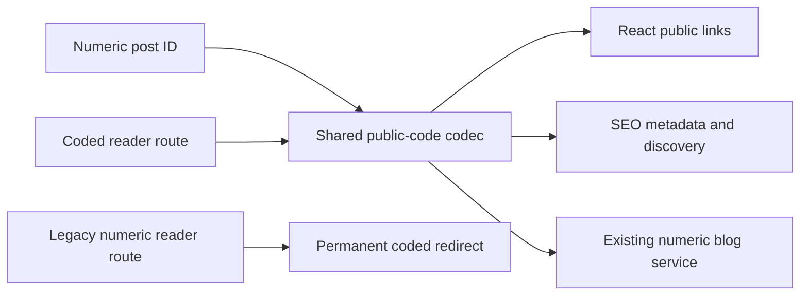

# Implementation Plan: Public Post Codes

**Branch**: `main`
**Spec**: [spec.md](./spec.md)
**Constitution**: [.specify/memory/constitution.md](../../.specify/memory/constitution.md)

## Technical Context

- **Stack**: React 18, TypeScript, Vite, React Router, Node.js ES modules, Vitest.
- **Source areas**: shared post-code utility, public React link producers, public detail route resolution, and `scripts/seo` URL/metadata/render/feed/server modules.
- **Backend contract**: Existing numeric post endpoints and response bodies remain unchanged.
- **Dependencies**: No new production dependency; reuse BigInt and existing platform primitives.
- **Code format**: Fixed `p` prefix plus a nine-character case-sensitive base-62 payload derived by a reversible permutation over positive safe integers.
- **Compatibility**: SEO gateway returns a permanent redirect for numeric reader URLs; client routing replaces numeric legacy paths where the gateway is absent.
- **Validation**: Codec vectors, focused component/link regressions, complete SEO gateway tests, type check, lint, build, and diff checks.

## Constitution Check

- **Spec-first user value**: Pass. Opaque public URLs, legacy compatibility, and internal API stability are explicit and measurable.
- **Superpowers execution discipline**: Pass with local fallback. The user reviewed the alternatives and selected encoded IDs; implementation will use test-first route and codec regressions. No Superpowers skill is installed in this session.
- **Contract-aligned frontend boundaries**: Pass. Public codes are resolved before the existing service call; no endpoint or response field is invented.
- **Design system and accessible UI**: Pass. No visual component or interaction design changes.
- **Focused verification**: Pass. Shared route/build-entry behavior justifies focused tests plus the production build gate.

## Loaded Agent Guides

- `docs/agent-guides/workflow.md`
- `docs/agent-guides/architecture.md`
- `docs/agent-guides/domain.md`
- `docs/agent-guides/project-reference.md`

No design-system files are changed.

## Phase 0: Research

See [research.md](./research.md).

## Phase 1: Design and Contracts

- Data model: [data-model.md](./data-model.md)
- Public route contract: [contracts/public-routes.md](./contracts/public-routes.md)
- Verification guide: [quickstart.md](./quickstart.md)

## File Structure

```text
src/core/utils/public-post-code.mjs
src/core/utils/public-post-code.test.ts
src/core/index.ts
src/features/blog/useBlogPostDetail.ts
src/**/public-link producers
scripts/seo/urls.mjs
scripts/seo/render.mjs
scripts/seo/metadata.mjs
scripts/seo/feeds.mjs
scripts/seo/server.mjs
scripts/seo/*.test.mjs
```

## Delivery Architecture



## Implementation Boundaries

1. Add one shared deterministic codec with strict validation and stable vector tests.
2. Change only reader-facing article links to coded paths.
3. Decode only the public `/blog/:id` route before calling the existing blog service.
4. Classify coded and numeric reader routes separately in the SEO gateway.
5. Generate coded article URLs in metadata, structured data, crawler fallback HTML, sitemap, and RSS.
6. Keep numeric backend, related-post, media-image, profile, and analytics identifiers unchanged.

## Risks and Mitigations

- **Configuration drift**: One shared module owns all codec constants and both runtimes consume it.
- **Broken old links**: Numeric reader URLs receive permanent redirects; client-only hosting replaces them too.
- **False security expectations**: Specs and code comments identify the transform as reversible obfuscation.
- **Invalid-code misrouting**: Validate shape, range, and canonical round trip before requesting a post.
- **SEO inconsistency**: Focused tests cover route policy, metadata, crawler links, sitemap, RSS, and server redirects.
- **Large-ID precision**: Reject values outside JavaScript's safe-integer range, matching the existing frontend numeric contract.

## Post-Design Constitution Check

- The existing API/service boundary is preserved.
- The route helper is shared infrastructure, not render-path business logic.
- The implementation adds no dependency or backend schema/API change.
- Public URL producers and compatibility behavior have explicit regression coverage.
