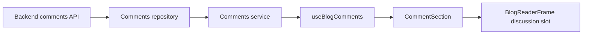

# Implementation Plan: Blog Comments

**Branch**: `main`
**Spec**: [spec.md](./spec.md)
**Backend counterpart**: [../../../horizon-blog-be/specs/005-blog-comments/plan.md](../../../horizon-blog-be/specs/005-blog-comments/plan.md)
**Constitution**: [.specify/memory/constitution.md](../../.specify/memory/constitution.md)

## Technical Context

- **Stack**: React 18, TypeScript, Chakra UI, React Router, Vitest.
- **Reader integration**: Optional discussion section in the existing reader frame.
- **Architecture**: Feature-local repository, service, hook/reducer, and small components.
- **Authentication**: Public reads; signed-in mutations; login return through existing route state.
- **Pagination**: Cursor-based sibling lists with load-more controls.
- **Content**: Plain text, maximum 2,000 characters.
- **Dependencies**: No new production dependency.
- **Validation**: Focused repository/service/reducer/component tests, reader failure-isolation regression, type check, lint, and build.

## Constitution Check

- **Spec-first user value**: Pass. Reading, participation, moderation, and failure isolation are testable.
- **Superpowers execution discipline**: Pass with local fallback. No Superpowers skill is installed; use focused test-first implementation.
- **Contract-aligned boundaries**: Pass. The backend contract defines endpoints, capabilities, and authorization.
- **Design system and accessibility**: Pass. The existing reader shell remains; the section uses semantic tokens and accessible controls.
- **Focused verification**: Pass. Shared reader composition justifies focused tests plus a production build.

## Loaded Agent Guides

- `docs/agent-guides/workflow.md`
- `docs/agent-guides/architecture.md`
- `docs/agent-guides/domain.md`
- `docs/agent-guides/design-system.md`
- `docs/agent-guides/project-reference.md`
- `design-system/MASTER.md`
- `design-system/pages/reader.md`
- `design-system/components/README.md`

## Phase 0: Research

See [research.md](./research.md).

## Phase 1: Design and Contract

- Frontend state model: [data-model.md](./data-model.md)
- UI contract: [contracts/comments-ui.md](./contracts/comments-ui.md)
- Verification guide: [quickstart.md](./quickstart.md)

## Delivery Architecture

## Implementation Boundaries

1. Add typed API DTOs, repository methods, service mapping, validation, and a feature-local dependency factory.
2. Add pure state helpers for cursor append/dedupe, edits, and removal/tombstone transitions.
3. Add the comments hook with isolated loading, retry, pagination, and mutation state.
4. Add accessible reader components for composer, thread, item actions, and owner settings.
5. Add `discussionSection` to the reader frame and mount it only on public blog detail.
6. Activate the reader interaction comment control as a scroll link.
7. Add focused tests and run the documented gates.

## Risks and Mitigations

- **Article regression**: Comments own their failure state and mount only after a post is available.
- **Transport leakage**: DTO mapping stays in repository/service files.
- **Unauthorized controls**: Render solely from backend capabilities.
- **Duplicate retries**: Reuse a pending UUID until success/cancel and dedupe by ID.
- **Unbounded nesting**: Exhaustive depth type and server capability stop replies after depth 2.
- **Unsafe content**: Render text nodes only with preserved whitespace.
- **Layout drift**: Reuse the central reader column and avoid card-heavy or animated treatment.

## Post-Design Constitution Check

- The existing reader, route, and blog service remain intact.
- Comments are a feature boundary rather than render-path transport code.
- API identities remain private.
- No product or technical clarification blocks task generation.
