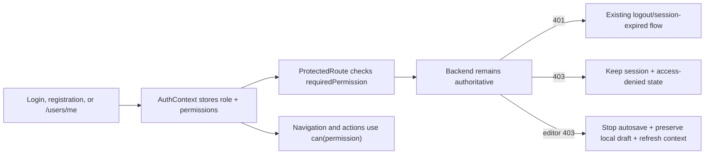

# Implementation Plan: RBAC Authorization

**Branch**: `main`  
**Spec**: [spec.md](./spec.md)  
**Backend counterpart**: [../../../horizon-blog-be/specs/007-rbac-authorization/plan.md](../../../horizon-blog-be/specs/007-rbac-authorization/plan.md)  
**API contract**: [../../../horizon-blog-be/specs/007-rbac-authorization/contracts/authorization-api.md](../../../horizon-blog-be/specs/007-rbac-authorization/contracts/authorization-api.md)  
**Constitution**: [.specify/memory/constitution.md](../../.specify/memory/constitution.md)

## Technical Context

- React 18, TypeScript, Chakra UI, React Router, existing AuthContext and repository/service/DI boundaries.
- The frontend currently knows signed-in versus signed-out only; editor and analytics share the same authentication-only gate.
- The backend adds private `authorization` context and owns every permission decision.
- No new production dependency and no JWT decoding changes.

## Loaded Guidance

- `AGENTS.md`
- `.specify/memory/constitution.md`
- `docs/agent-guides/workflow.md`
- `docs/agent-guides/architecture.md`
- `docs/agent-guides/domain.md`
- `docs/agent-guides/project-reference.md`
- `docs/agent-guides/design-system.md`
- `design-system/MASTER.md`
- `design-system/components/README.md`
- `design-system/pages/README.md`
- `design-system/pages/editor.md`
- `design-system/pages/profile.md`

## Constitution Check

- **Spec-first user value**: Pass. Member, author, admin, demotion, public, and denial outcomes are explicit.
- **Superpowers execution discipline**: Pass with local fallback; no installed plugin is available, so approval gates and verification artifacts provide the execution discipline.
- **Contract alignment**: Pass. The backend owns fields, endpoints, status codes, and permission meanings.
- **Design system**: Pass. New protected/admin surfaces use the standard panel model, semantic tokens, clear focus, light/dark states, and restrained motion.
- **Focused verification**: Pass. Type, route, service, autosave, error-state, lint, and production-build gates are named.

## Client Flow



## Delivery Phases

### Phase 1: Authorization domain and private contract

1. Add typed `Role`, `Permission`, and `AuthorizationContext` values plus a pure `can(permission)` helper.
2. Extend private login/registration and profile API mappings; never add fields to public user types.
3. Store the latest authorization context in AuthContext and refresh it through `/users/me` on session restoration or permission loss.
4. Treat missing context as no author/admin permission while hydration is incomplete.

**Primary surfaces**:

- `src/core/types/common.types.ts`
- `src/core/types/profile.types.ts`
- `src/core/repositories/profile.repository.ts`
- `src/core/services/profile.service.ts`
- `src/core/services/auth.service.ts`
- `src/context/AuthContext.tsx`
- `src/core/authorization/`

### Phase 2: Permission-aware routes and navigation

1. Extend `ProtectedRoute` with optional `requiredPermission` and a calm access-denied state.
2. Require `content:manage:own` for `/blog-editor*`, `analytics:read:own` for `/analytics*`, and `roles:assign` for `/admin/access`.
3. Gate Write/Publish, Analytics, admin access, and authoring home/profile calls to action with the same helper.
4. Keep profile self-service and server-projected comment controls intact.

**Primary surfaces**:

- `src/components/ProtectedRoute.tsx`
- `src/Routes.tsx`
- `src/app/layouts/Navbar.tsx`
- `src/app/layouts/UserMenu.tsx`
- `src/features/home/pages/HomePage.tsx`
- `src/features/profile/`
- `src/features/author-analytics/`

### Phase 3: Permission-loss and status-aware UX

1. Preserve the existing `401` interceptor behavior.
2. Add explicit `403` classification/copy for protected routes and analytics without clearing auth.
3. On authoring `403`, stop autosave retries, preserve the local draft, show a persistent permission-lost panel, and refresh `/users/me`.
4. Ensure recovery copy explains access loss without claiming that the session expired or content was deleted.

**Primary surfaces**:

- `src/core/services/api.service.ts`
- `src/core/services/auth.interceptor.ts`
- `src/features/editor/hooks/useAutoSave.ts`
- `src/features/editor/`
- `src/features/author-analytics/author-analytics.hook-state.ts`
- `src/features/author-analytics/author-analytics.visualization.ts`

### Phase 4: Minimal admin access page

1. Add a feature-owned `/admin/access` page using the approved user-list and role-update endpoints through API adapter/service/hook boundaries.
2. Show only the minimum private fields in the backend contract and supported fixed roles.
3. Handle `changed: false`, validation, `403`, `404`, and last-admin `409` explicitly.
4. Use a standard editorial panel/list rather than a dashboard-heavy layout; use semantic action tokens and accessible select/focus/status treatment.
5. Do not add audit browsing or cross-owner content management.

**Primary surfaces**:

- `src/features/access-management/`
- `src/core/di/container.ts`
- `src/Routes.tsx`
- `src/app/layouts/UserMenu.tsx`

## Risks and Mitigations

- **UI mistaken for enforcement**: tests prove forged client state still receives backend denial.
- **Stale role after demotion**: the first `403` refreshes current private context; backend is already effective immediately.
- **Lost editor work**: stop autosave and preserve draft state before changing navigation.
- **401/403 confusion**: only `401` clears auth; `403` renders access denied.
- **Public data leakage**: separate public and private user types/mappers and contract tests.
- **Matrix drift**: UI consumes effective permissions rather than reconstructing permissions from role.
- **Administrative visual sprawl**: one minimal feature-owned access page, no dashboard framework.

## Verification

Focused tests must cover:

- `can(permission)` and absent/unknown permission behavior;
- private mapping versus public DTO non-leakage;
- member/author/admin route matrix;
- navbar/home/profile action visibility;
- `401` clears session while `403` does not;
- editor `403` stops autosave and preserves local draft;
- role update success, no-change, validation, forbidden, missing, and conflict states;
- public routes render without private authorization context.

Implementation-time commands:

```bash
rtk yarn test
rtk yarn tsc --noEmit
rtk yarn lint
rtk yarn build
```

The production build is required because this feature changes shared auth state, routes, DI, and lazy route composition.

## Implementation and Rollout Gates

1. Backend private context and admin API contract are approved.
2. Backend enforcement deploys before or with the frontend permission UI.
3. Admin bootstrap is verified before the admin page is used.
4. Authentication/session redesign remains a separate follow-up.

## Post-Design Constitution Check

- API details come only from the linked backend contract.
- State and data access follow `apiService -> adapter -> service -> hook/page -> component`.
- Permission UI is small, feature-owned, accessible, and not a security boundary.
- No new dependency, token behavior, audit viewer, or cross-owner content browser is introduced.
