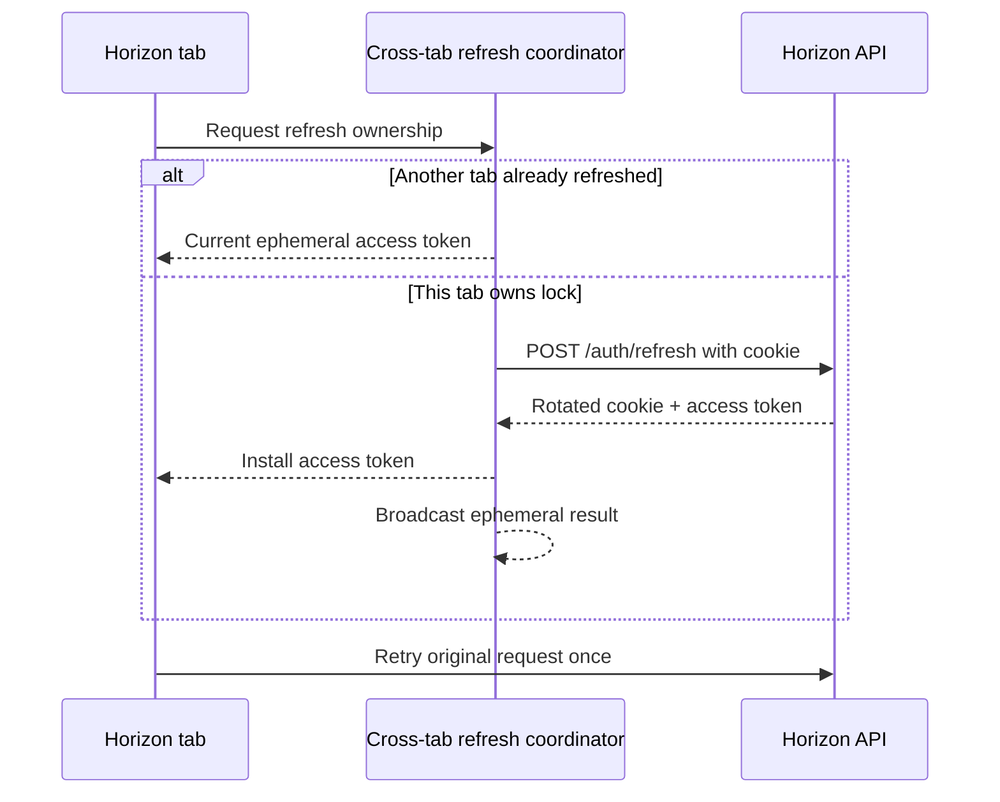

# Implementation Plan: Authentication Session Lifecycle

**Branch**: `main`

**Spec**: [spec.md](./spec.md)

**Backend counterpart**: [../../../horizon-blog-be/specs/008-authentication-session-lifecycle/plan.md](../../../horizon-blog-be/specs/008-authentication-session-lifecycle/plan.md)

**API contract**: [../../../horizon-blog-be/specs/008-authentication-session-lifecycle/contracts/authentication-api.md](../../../horizon-blog-be/specs/008-authentication-session-lifecycle/contracts/authentication-api.md)

**Research**: [../../../horizon-blog-be/specs/008-authentication-session-lifecycle/research.md](../../../horizon-blog-be/specs/008-authentication-session-lifecycle/research.md)

**Constitution**: [.specify/memory/constitution.md](../../.specify/memory/constitution.md)

## Outcome

Move Horizon's browser authentication from a persistent JWT to a coordinated session lifecycle: access token in memory, refresh through the backend-owned HttpOnly cookie, safe one-time request retry, cross-tab rotation coordination, async server logout, and token-free Google redirects.

The frontend manages experience and credential transport only. The backend owns session validity and Authorization owns permissions.

## Technical Context

- **Stack**: React 18, TypeScript, Chakra UI, React Router, existing AuthContext, service/repository adapters, Vitest, and Yarn.
- **Current state**: `AuthService` stores `horizon_blog_token` in localStorage; AuthContext decodes it then calls `/users/me`; the interceptor clears it on the first `401`; only GET has a guest retry; fetch omits credentialed cookies; Google callback parses JWT from the URL fragment.
- **Target state**: one in-memory token store and one session coordinator own access state; all API methods use the same credentials/retry pipeline; refresh is single-flight in one context and Web Locks/BroadcastChannel coordinated across tabs.
- **Backend contract**: HttpOnly refresh cookie, `POST /auth/refresh`, `POST /auth/logout`, target `access_token` response, token-free Google callback, and strict rotation.
- **Authorization interaction**: `401` may refresh; `403` never refreshes or signs out and continues to use the linked RBAC UX.
- **Dependencies**: no new production or test dependency.
- **Visual scope**: reuse the existing authentication shell, semantic tokens, loading treatment, and calm error panels; no redesign.

## Loaded Guidance

- `AGENTS.md`
- `.specify/memory/constitution.md`
- `docs/agent-guides/workflow.md`
- `docs/agent-guides/architecture.md`
- `docs/agent-guides/domain.md`
- `docs/agent-guides/project-reference.md`
- `docs/agent-guides/design-system.md`
- `design-system/MASTER.md`
- `design-system/pages/auth.md`

## Constitution Check

- **Spec-first user value**: Pass. Sign-in, restoration, coordination, logout, Google, error, storage, and migration outcomes are explicit.
- **Superpowers execution discipline**: Pass with local fallback. The recommended plugin is not installed; the plan uses researched contracts, phased review, test-first slices, and explicit gates.
- **Contract alignment**: Pass. Cookie attributes, endpoints, response fields, status semantics, and rollout come only from the backend contract.
- **Architecture**: Pass. Transport, token state, session coordination, domain mapping, and UI state retain narrow ownership rather than concentrating in components.
- **Design system**: Pass. Existing authentication visuals remain authoritative and new states reuse semantic patterns.
- **Verification**: Pass. Store, retry, concurrency, multi-tab, callback, route, lint, type, test, and build checks are named.

## Browser Session Flow



The refresh credential never enters JavaScript or BroadcastChannel. If refresh fails, the coordinator broadcasts only signed-out state.

## Core Boundaries

### In-memory access-token store

Add a small observable/injectable store with `get`, `set`, `clear`, and optional `expiresAt`. It is the only source for Authorization headers. It performs no localStorage/sessionStorage writes and contains no refresh behavior.

The migration bootstrap removes the legacy `horizon_blog_token` key and does not exchange it for a durable session. The reserved but unused client refresh-token key is retired.

### Session coordinator

Add an `AuthSessionService` that owns login, registration, refresh, logout, access installation/clearing, one unauthorized transition, and coordination. A dedicated raw auth transport calls refresh/logout without going through the retrying API path, avoiding circular dependencies and recursion.

Within a tab, all callers share one `refreshPromise`. Across tabs, a named Web Lock chooses the rotator and BroadcastChannel carries only ephemeral access/logout results. A waiter rechecks the token/version after acquiring the lock so it does not submit a stale cookie after another tab succeeds. The supported baseline requires both coordination primitives; their absence or failure settles into re-login instead of unsafe per-tab rotation.

### Unified request pipeline

Refactor ApiService to one internal request pipeline for GET/POST/PUT/PATCH/DELETE and FormData. It builds a new request/body for the single retry, always uses `credentials: 'include'` for API calls, and accepts explicit auth metadata:

- `required`: attach access and allow one coordinated refresh on `401`;
- `optional`: attach access when available and permit an explicit guest fallback when approved by the caller;
- `transport`: login/register/refresh/logout/reset paths never trigger generic refresh.

On `401`, first check whether the token changed since the request began. Retry with the current token if so; otherwise await the shared refresh. Never retry more than once. A `403` bypasses this logic entirely.

### AuthContext and lifecycle UI

AuthProvider begins in `LOADING`, clears the legacy storage token, attempts session refresh, and loads `/users/me` only after access exists. Refresh failure settles to unauthenticated and leaves public routes available. Login/registration install the returned access value and private user/Authorization context.

Logout awaits the backend request and clears local state in `finally`. Since JavaScript cannot delete the HttpOnly cookie, a network failure is presented as local sign-out with server-revocation uncertainty, not a false success claim.

### Google callback

The callback stops parsing tokens and instead waits for AuthProvider/session restoration after the backend sets the cookie. Redirect normalization accepts only safe relative destinations. Temporary compatibility with the legacy backend fragment may exist before rollout, but fragment token handling is removed before the feature is complete.

## Delivery Phases

### Phase 1: Token state and raw authentication transport

1. Add typed access-response/session interfaces compatible with both the rollout alias and target `access_token` field.
2. Add the in-memory access-token store with focused tests proving no persistent storage.
3. Add a narrow raw auth transport for login, registration, refresh, logout, and password/reset operations using credentialed fetch and no retry recursion.
4. Add the session coordinator with injectable dependencies and one in-context refresh promise.

**Primary surfaces**:

- `src/core/types/auth.types.ts`
- `src/core/services/access-token.store.ts`
- `src/core/services/auth-session.service.ts`
- `src/core/services/auth.transport.ts`
- focused service tests

### Phase 2: Unified API request and retry semantics

1. Refactor ApiService to one request factory/pipeline across methods and supported bodies.
2. Inject the memory store instead of reading localStorage in the interceptor.
3. Implement token-version race handling, one shared refresh, one retry, and one unauthorized emission.
4. Mark authentication transport as non-refreshing and make optional guest fallback explicit instead of automatic for every GET.
5. Prove `403` never refreshes or clears the session, preserving RBAC behavior.

**Primary surfaces**:

- `src/core/services/api.service.ts`
- `src/core/services/auth.interceptor.ts`
- `src/core/di/container.ts`
- existing repositories/services that rely on optional public GET behavior
- API/interceptor tests including JSON and FormData

### Phase 3: Bootstrap, login, logout, and migration behavior

1. Refactor AuthContext to restore through cookie refresh and then `/users/me`, with explicit loading/authenticated/unauthenticated transitions.
2. Update login/registration to use the common response and install only the in-memory access token.
3. Make logout asynchronous, clear state in `finally`, notify other tabs, and surface network uncertainty accurately.
4. Remove the legacy localStorage token on bootstrap and accept the one-time login transition without a refresh loop.
5. Preserve private Authorization context from the linked RBAC contract without deriving it from JWT claims.

**Primary surfaces**:

- `src/context/AuthContext.tsx`
- `src/core/services/auth.service.ts`
- `src/features/auth/`
- `src/app/layouts/Navbar.tsx`
- private profile/auth mappings

### Phase 4: Cross-tab refresh coordination

1. Add a same-origin coordinator using a stable Web Lock name and versioned BroadcastChannel messages.
2. Broadcast only ephemeral access-token installation or logout/session-invalid state; never refresh token, cookie, password, or Authorization header.
3. Recheck the current token/version inside the lock before calling refresh.
4. Handle lock-holder closure, timeout/error, duplicate messages, and tab teardown without infinite retries.
5. Add supported-browser integration tests for simultaneous bootstrap and simultaneous expiry.

**Primary surfaces**:

- `src/core/services/auth-session-coordinator.ts`
- `src/core/services/auth-session.service.ts`
- coordinator/unit/integration tests

### Phase 5: Google callback and lifecycle UX

1. Remove access-token fragment parsing and token-based OAuth completion.
2. Make the callback wait for the standard AuthProvider restoration result before navigation.
3. Harden redirect normalization against absolute and protocol-relative values.
4. Preserve existing sanitized provider errors and render session-expired/logout-uncertain states in the existing authentication visual language.
5. Remove `jwt-decode` only if repository-wide usage is zero; update the lockfile as a scoped cleanup without adding a replacement dependency.

**Primary surfaces**:

- `src/features/auth/pages/LoginCallbackPage.tsx`
- `src/features/auth/utils/googleSso.ts`
- `src/features/auth/`
- `package.json`
- `yarn.lock`

### Phase 6: Contracts, documentation, and rollout verification

1. Update the frontend API snapshot only after backend contract approval and regeneration.
2. Update domain/auth documentation for memory access state, server cookie ownership, `401` refresh, and `403` preservation.
3. Run targeted and complete test/type/lint/build gates.
4. Deploy this refresh-capable client before backend access TTL changes from 24 hours to 15 minutes.
5. Remove compatibility parsing/aliases only after backend adoption evidence is reviewed.

**Primary surfaces**:

- `api-docs.json`
- `docs/agent-guides/domain.md`
- authentication test suites
- deployment verification checklist

## Test Plan

### Unit and service tests

- Memory store set/get/clear and zero persistent writes.
- Login/registration install access; refresh uses credentials; logout clears in `finally`.
- N concurrent same-context refresh callers make one transport call.
- Token-changed race retries with the current value without a second refresh.
- Failed refresh clears/emits once; `403` does neither.
- Request bodies are reconstructed for exactly one retry.
- Authentication transports never recurse.
- Optional guest fallback occurs only when marked.

### Context and route tests

- Reload refresh success loads profile and Authorization context.
- Refresh `401` settles unauthenticated; protected routes remain loading until bootstrap ends.
- Public routes remain available without a session.
- Legacy localStorage token is deleted and never rewritten.
- Logout success/network failure and cross-tab logout state are represented accurately.
- Existing RBAC `403` flows keep session and protected local work.

### Google and cross-tab tests

- Callback contains no token parsing and waits for restoration.
- Unsafe destinations are rejected.
- Two tabs cause one rotation and both receive ephemeral access state.
- Refresh credentials are absent from messages and storage.
- Lost/failed rotation settles safely without repeated cookie submission.

## Implementation-time Commands

```bash
rtk yarn test
rtk yarn tsc --noEmit
rtk yarn lint
rtk yarn build
```

The production build is mandatory because shared request transport, DI, AuthContext, routes, and callback composition change.

## Rollout Gates

1. Backend contract, cookie/origin configuration, and compatibility fields are approved.
2. Frontend refresh/retry/multi-tab behavior passes while backend access TTL remains 24 hours.
3. Backend durable refresh sessions and Google session-only redirect deploy with compatibility enabled.
4. Browser production smoke tests cover reload, two tabs, logout, Google, `401`, and `403`.
5. Only after those checks may backend issue 15-minute tokens.
6. Legacy storage/fragment/alias removal follows verified adoption and remains separately reviewed.

## Risks and Mitigations

- **Circular retry dependency**: raw auth transport bypasses ApiService refresh logic.
- **Duplicate mutation after expiry**: one retry maximum and a recreated request body; backend idempotency remains independently required where appropriate.
- **False refresh replay across tabs**: Web Lock ownership plus token-version recheck and ephemeral result broadcast.
- **Credential persistence regression**: one store boundary and negative storage/log tests.
- **Logout overclaims**: local cleanup is guaranteed, while network failure copy does not assert server revoke.
- **401/403 regression**: explicit auth modes and status tests keep Authorization denial separate.
- **Public GET behavior changes**: audit current guest-fallback callers and mark only intentional optional requests.
- **Google redirect leak**: no credential parsing/forwarding and URL/history tests.
- **TTL cutover outage**: frontend deployment and production smoke checks precede backend shortening.

## Post-Design Constitution Check

- Browser lifecycle behavior is specified before implementation and linked to the backend source contract.
- Services own transport/state; components render lifecycle outcomes.
- Existing architecture and visual language are preserved without a new dependency.
- Persistent credential storage, recursive refresh, implicit guest fallback, and `403` logout are explicitly prevented.
- No unresolved design question blocks task generation; implementation and deployment remain approval-gated.
