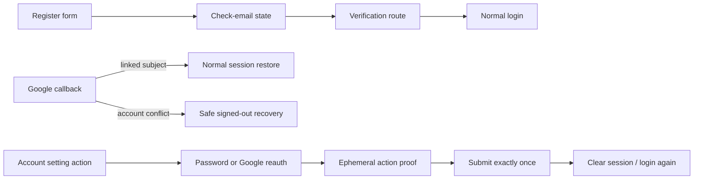

# Implementation Plan: API Security Hardening

**Branch**: `main`

**Spec**: [spec.md](./spec.md)

**Backend counterpart**: [../../../horizon-blog-be/specs/009-api-security-hardening/plan.md](../../../horizon-blog-be/specs/009-api-security-hardening/plan.md)

**API contract**: [../../../horizon-blog-be/specs/009-api-security-hardening/contracts/api-security-hardening.md](../../../horizon-blog-be/specs/009-api-security-hardening/contracts/api-security-hardening.md)

**Constitution**: [.specify/memory/constitution.md](../../.specify/memory/constitution.md)

## Outcome

Move registration and sensitive account settings onto the hardened backend contract, represent security failures honestly, remove client visitor authority and SVG upload, and preserve the current memory-only session and RBAC behavior.

## Technical Context

- **Stack**: React, TypeScript, Chakra UI, React Router, existing AuthContext/AuthSessionService, repositories/services, Vitest, Yarn.
- **Architecture**: `apiService -> feature API adapter -> service/use-case -> hook/page -> component`.
- **Dependencies**: none added.
- **Routes**: add verification result route; extend register/login callback/profile account settings without route-family redesign.
- **Security state**: verification/proof/password values remain feature-local and memory-only.
- **Transport**: proof-bound mutations use explicit non-replaying mode; normal refresh coordination remains unchanged elsewhere.
- **Visuals**: existing auth and profile design docs; no new system tokens expected.

## Loaded Guidance

- `AGENTS.md`
- `.specify/memory/constitution.md`
- `docs/agent-guides/workflow.md`
- `docs/agent-guides/architecture.md`
- `docs/agent-guides/domain.md`
- `docs/agent-guides/project-reference.md`
- `docs/agent-guides/design-system.md`
- `design-system/MASTER.md`
- `design-system/pages/auth.md`
- `design-system/pages/profile.md`

## Constitution Check

- **Spec-first value**: Pass. Verification, conflict, proof, account action, error, media, and visitor outcomes are explicit.
- **Execution discipline**: Pass through linked backend decisions, story files, approval gates, and test-first tasks.
- **Contract alignment**: Pass. All endpoints/statuses come from the backend contract.
- **Architecture**: Pass. Transport and proof orchestration stay out of components.
- **Design system**: Pass. Existing auth/profile patterns are reused with accessible states and no redesign.
- **Focused verification**: Pass. Targeted unit/route/service gates plus type, lint, and production build are specified.

## Flow



## Core Boundaries

### Auth adapter and service

Extend auth types/transport for pending registration, verify/resend, reauthentication, and conflict codes. AuthSessionService must not install a token for pending registration and remains the only owner of session clear/restore.

### Account-security feature

Add a focused feature API adapter and service for proof acquisition and sensitive mutations. A hook/page orchestrates action selection, proof lifetime, single submission, cancellation, and sign-out. Components render fields and status only.

### Request retry semantics

Add or use explicit request metadata for non-replaying sensitive operations. A `401` before proof-bound mutation requires fresh session and proof. `403`, `429`, `413`, proof errors, and validation errors do not trigger automatic replay.

### Verification and conflict UX

Registration, verification, and callback conflict reuse `AuthShell`; use direct human copy and existing semantic tokens. Remove URL verification token after the first exchange. Preserve safe intended destination only where already supported.

### Media and engagement adapters

Remove SVG from upload selection/validation but do not filter existing rendered media. Remove visitor-ID generation/storage/payload mapping; keep credentialed requests.

## Delivery Phases

### Phase 1: Contract types and pending registration

1. Add status-aware types and non-replaying request mode tests.
2. Change registration service/context behavior to pending, never authenticated.
3. Add verification/resend adapter, route, and auth-shell states.
4. Handle unverified-login and Google conflict states.

### Phase 2: Sensitive account feature

1. Add account-security adapter/service and ephemeral proof controller.
2. Add password and Google reauthentication journeys.
3. Add password/email/deletion panels and confirmations.
4. Clear session on successful security mutation and handle proof/rate/last-admin errors.
5. Remove legacy mutation calls.

### Phase 3: Media, visitor, and resilience cleanup

1. Restrict media input to JPEG/PNG and handle backend `415`.
2. Remove visitor IDs from analytics/reaction clients and storage.
3. Add `429`/`413` helpers without exposing policy internals.
4. Update API snapshot/docs after backend generation.

### Phase 4: Cross-repo verification and rollout

1. Run targeted services, contexts, routes, and components tests.
2. Run type, lint, format check, and production build.
3. Test against hardened staging API while compatibility is enabled.
4. Remove legacy compatibility only after backend and frontend adoption evidence.

## Primary Surfaces

- `src/core/types/auth.types.ts`
- `src/core/services/auth.transport.ts`
- `src/core/services/auth-session.service.ts`
- `src/core/services/api.service.ts`
- `src/features/auth/`
- `src/features/account-security/`
- `src/context/AuthContext.tsx`
- `src/features/media/`
- analytics/reaction adapters under `src/core/` and `src/features/`
- `src/Routes.tsx` and `api-docs.json`

## Verification

```bash
rtk yarn test
rtk yarn tsc --noEmit
rtk yarn lint
rtk yarn format
rtk yarn build
```

The production build is required because shared auth transport, DI, routes, and AuthContext behavior change.

## Rollout Gates

1. Backend contract and generated snapshot are stable.
2. Pending registration UI deploys before verification enforcement.
3. Sensitive action UI deploys before legacy routes return `410`.
4. Visitor-ID fields are removed only after backend accepts the cookie path.
5. Production smoke covers registration, verification, existing Google login, conflict, proof flows, sign-out, `401`, `403`, `429`, upload, and existing media.

## Risks and Mitigations

- **Accidental login after registration**: explicit pending response type cannot carry auth credentials.
- **Proof replay by generic interceptor**: one-attempt transport mode and proof clearing.
- **Secret persistence**: negative storage/channel/log tests.
- **Google regression**: existing linked-subject callback remains a separate test.
- **Legacy SVG regression**: change upload validation only, not reader rendering.
- **Contract drift**: backend contract and API snapshot gate every adapter change.

## Commit Discipline

When implementation and commits are explicitly authorized, complete and validate one task at a time, update the readiness tracker, and keep each commit scoped to that task or an inseparable backend-contract boundary. This planning work itself does not authorize commit or push.
