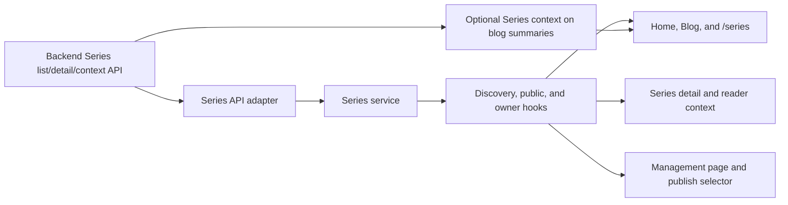

# Implementation Plan: Series Discovery and Reading

**Branch**: `agent/series-learning-path`
**Spec**: [spec.md](./spec.md)
**Backend counterpart**: [../../../horizon-blog-be/specs/010-series-learning-path/plan.md](../../../horizon-blog-be/specs/010-series-learning-path/plan.md)
**Constitution**: [.specify/memory/constitution.md](../../.specify/memory/constitution.md)

## Technical Context

- **Stack**: React 18, TypeScript, Chakra UI, React Router, Vitest.
- **Architecture**: Feature-local Series API/service/hooks/components/pages; public blog summary mapping gains additive optional Series context.
- **Reader integration**: Existing `helperSection` slot in `BlogReaderFrame`.
- **Author integration**: New protected management route and additive selector in publication review.
- **Discovery integration**: Home shelf after the unchanged hero, default Blog shelf before results, and a new public `/series` route.
- **Public metadata**: Part excerpt/read time/tags, total reading time, last-updated date, canonical metadata, and sitemap coverage.
- **Progress**: No public opened/completion state; remove the current local-progress presentation and unused helper path.
- **Dependencies**: No new production dependency.
- **Validation**: Focused mapping/discovery/component tests, reader failure regression, SEO gateway tests, type check, lint, production build, and responsive visual review.

## Constitution Check

- **Spec-first user value**: Pass. Public discovery, ordered reading, author control, fallback, and accessibility are testable.
- **Superpowers execution discipline**: Pass with local fallback. Clarification, research, focused test-first implementation, and verification preserve the gates.
- **Contract alignment**: Pass. The frontend consumes only the backend series contract.
- **Design system**: Pass. Existing semantic tokens and reader/editor/profile rules override generic skill suggestions.
- **Focused verification**: Pass. Route and reader composition changes justify a production build.

## Loaded Agent Guides

- `docs/agent-guides/workflow.md`
- `docs/agent-guides/architecture.md`
- `docs/agent-guides/domain.md`
- `docs/agent-guides/design-system.md`
- `docs/agent-guides/project-reference.md`
- `design-system/MASTER.md`
- `design-system/components/README.md`
- `design-system/pages/reader.md`
- `design-system/pages/home.md`
- `design-system/pages/blog.md`
- `design-system/pages/series.md`
- `design-system/pages/editor.md`
- `design-system/pages/profile.md`

## Phase 0: Research

See [research.md](./research.md).

## Phase 1: Design and Contract

- State model: [data-model.md](./data-model.md)
- UI contract: [contracts/series-ui.md](./contracts/series-ui.md)
- Verification guide: [quickstart.md](./quickstart.md)

## Delivery Architecture

## Implementation Boundaries

1. Preserve the completed typed Series transport, detail/context, owner service, management route, and publication assignment.
2. Extend the backend-owned contract with public Series summaries, enriched public parts, and optional Series context on public blog summaries.
3. Add public list mapping and an independent discovery hook with shelf-safe failure behavior.
4. Add reusable Series cards/shelf, integrate Home and Blog, and add `/series` through a thin route wrapper.
5. Align `/series/:slug` with the approved editorial detail design and remove public progress presentation.
6. Keep reader context failure-isolated and update public copy to use Series terminology only.
7. Add canonical metadata, sitemap coverage, route/server regressions, component tests, and responsive/accessibility validation.

## Risks and Mitigations

- **Article regression**: Series context owns its failure state and uses the existing helper slot.
- **Transport leakage**: DTOs remain in adapter/service files.
- **Discovery regression**: Home/Blog shelves own independent loading and failure state and never gate the blog feed.
- **N+1 requests**: Blog summaries carry compact Series context; shelves use a bounded list request.
- **Misleading progress**: Remove opened/completion UI and its unused local-storage path.
- **Publish inconsistency**: Save atomic backend membership before publishing/scheduling.
- **Layout drift**: Use standard panels, semantic tokens, and no new typography or decorative system.
- **SEO regression**: Treat public Series routes separately from protected `/series/manage`; assert metadata, sitemap, status, and crawler behavior.

## Post-Design Constitution Check

- Reader/editor conventions remain intact.
- Public and owner state are separated.
- No new dependency or architecture change is required.
- No unresolved clarification blocks task generation.
- Approved UI is captured in `ui-ux.md` and governed by `design-system/pages/series.md`.
