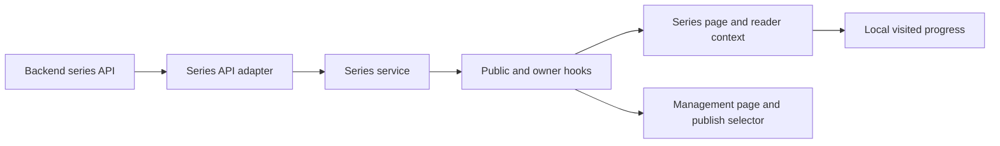

# Implementation Plan: Series Learning Paths

**Branch**: `agent/series-learning-path`
**Spec**: [spec.md](./spec.md)
**Backend counterpart**: [../../../horizon-blog-be/specs/010-series-learning-path/plan.md](../../../horizon-blog-be/specs/010-series-learning-path/plan.md)
**Constitution**: [.specify/memory/constitution.md](../../.specify/memory/constitution.md)

## Technical Context

- **Stack**: React 18, TypeScript, Chakra UI, React Router, Vitest.
- **Architecture**: Feature-local series API/service/hooks/components/pages; existing blog service remains intact.
- **Reader integration**: Existing `helperSection` slot in `BlogReaderFrame`.
- **Author integration**: New protected management route and additive selector in publication review.
- **Progress**: Versioned, failure-safe local storage for visited parts.
- **Dependencies**: No new production dependency.
- **Validation**: Focused mapping/progress/component tests, reader failure regression, type check, lint, and production build.

## Constitution Check

- **Spec-first user value**: Pass. Reader continuity, author control, fallback, and accessibility are testable.
- **Superpowers execution discipline**: Pass with local fallback. Clarification, research, focused test-first implementation, and verification preserve the gates.
- **Contract alignment**: Pass. The frontend consumes only the backend series contract.
- **Design system**: Pass. Existing semantic tokens and reader/editor/profile rules override generic skill suggestions.
- **Focused verification**: Pass. Route and reader composition changes justify a production build.

## Loaded Agent Guides

- `docs/agent-guides/workflow.md`
- `docs/agent-guides/architecture.md`
- `docs/agent-guides/domain.md`
- `docs/agent-guides/design-system.md`
- `docs/agent-guides/project-reference.md`
- `design-system/MASTER.md`
- `design-system/components/README.md`
- `design-system/pages/reader.md`
- `design-system/pages/editor.md`
- `design-system/pages/profile.md`

## Phase 0: Research

See [research.md](./research.md).

## Phase 1: Design and Contract

- State model: [data-model.md](./data-model.md)
- UI contract: [contracts/series-ui.md](./contracts/series-ui.md)
- Verification guide: [quickstart.md](./quickstart.md)

## Delivery Architecture

## Implementation Boundaries

1. Add typed DTO/domain mapping, transport methods, and a feature-local service factory.
2. Add pure local-progress helpers and focused tests.
3. Add public series/context hooks and accessible reader components.
4. Add public and protected routes through thin page wrappers.
5. Add owner CRUD/order management and publication-review assignment.
6. Add failure-isolation and component tests, then run full static/build gates.

## Risks and Mitigations

- **Article regression**: Series context owns its failure state and uses the existing helper slot.
- **Transport leakage**: DTOs remain in adapter/service files.
- **Misleading progress**: Copy says opened/read progress, never completed.
- **Stale storage**: Intersect stored IDs with current public parts.
- **Publish inconsistency**: Save atomic backend membership before publishing/scheduling.
- **Layout drift**: Use standard panels, semantic tokens, and no new typography or decorative system.

## Post-Design Constitution Check

- Reader/editor conventions remain intact.
- Public and owner state are separated.
- No new dependency or architecture change is required.
- No unresolved clarification blocks task generation.
