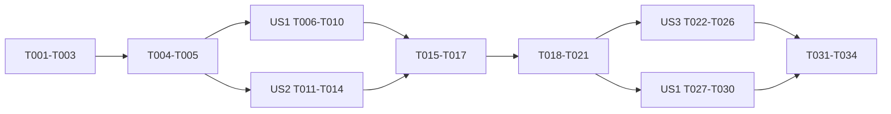

# Tasks: Series Discovery and Reading Frontend

> T001-T017 record the first implementation pass. T018 onward align that implementation with the approved public discovery UI and replace the earlier local-progress direction.

## Phase 1: Setup

- [x] T001 Add series API/domain types and mapping in `src/features/series/series.types.ts` and `src/features/series/series.service.ts`
- [x] T002 [P] Add transport methods and service tests in `src/features/series/series.api.ts` and `src/features/series/series.service.test.ts`
- [x] T003 [P] Add the feature-local dependency factory in `src/features/series/series.dependencies.ts`

## Phase 2: Foundational

- [x] T004 Add failure-safe local visited progress and tests in `src/features/series/series.progress.ts` and `src/features/series/series.progress.test.ts`
- [x] T005 Add public and owner state hooks in `src/features/series/usePublicSeries.ts`, `src/features/series/useSeriesContext.ts`, and `src/features/series/useOwnerSeries.ts`

## Phase 3: User Story 1 - Public Series reading

**Independent test**: A reader opens a public Series, sees ordered public parts, and navigates adjacent parts from a member blog while article rendering survives Series failure.

- [x] T006 [P] [US1] Add public page/context component tests in `src/features/series/components/SeriesPartList.test.tsx` and `src/features/series/components/SeriesContextCard.test.tsx`
- [x] T007 [US1] Implement public series components in `src/features/series/components/SeriesPartList.tsx` and `src/features/series/components/SeriesContextCard.tsx`
- [x] T008 [US1] Implement the public route page and thin wrapper in `src/features/series/pages/SeriesPage.tsx` and `src/pages/Series.tsx`
- [x] T009 [US1] Integrate failure-isolated series context in `src/features/blog/pages/BlogDetailPage.tsx`
- [x] T010 [US1] Register `/series/:slug` in `src/Routes.tsx` and extend reader regression coverage in `src/features/blog/pages/BlogDetailPage.performance.test.tsx`

## Phase 4: User Story 2 - Owner management

**Independent test**: An author creates, edits, deletes, adds, removes, and reorders series blogs, then selects zero or one series before publishing.

- [x] T011 [P] [US2] Add owner management component/service tests in `src/features/series/components/SeriesManager.test.tsx` and `src/features/series/series.service.test.ts`
- [x] T012 [US2] Implement accessible owner management in `src/features/series/components/SeriesManager.tsx` and `src/features/series/pages/ManageSeriesPage.tsx`
- [x] T013 [US2] Add the thin route wrapper and protected `/series/manage` route in `src/pages/ManageSeries.tsx` and `src/Routes.tsx`
- [x] T014 [US2] Add series selection and membership persistence to `src/features/editor/pages/PublishBlogPage.tsx`

## Phase 5: Delivery

- [x] T015 Update route/reader/editor design docs in `docs/agent-guides/project-reference.md`, `design-system/pages/reader.md`, and `design-system/pages/editor.md`
- [x] T016 Run focused tests, `yarn tsc --noEmit`, `yarn lint`, `yarn build`, responsive/accessibility review, and record results in `specs/015-series-learning-path/quickstart.md`
- [x] T017 Fix the production SEO gateway classification for `/series/manage` and `/series/:slug`, then add route and server regressions proving both URLs receive the client app shell instead of a static 404

## Phase 6: Approved UI foundation

- [x] T018 Capture all six approved public, reader-context, and owner compositions in `specs/015-series-learning-path/ui-ux.md`, `specs/015-series-learning-path/assets/ui/`, and `design-system/pages/series.md`
- [x] T019 [P] [US3] Extend public Series list/detail DTOs and domain mapping with summary, pagination, excerpt, reading time, tags, and updated date in `src/features/series/series.types.ts`, `src/features/series/series.api.ts`, `src/features/series/series.service.ts`, and `src/features/series/series.service.test.ts`
- [x] T020 [P] [US3] Map additive optional Series membership context on public blog summaries in `src/core/types/blog.types.ts`, `src/core/utils/blog-mapping.utils.ts`, and `src/core/repositories/blog.repository.performance.test.ts`
- [x] T021 [US3] Add independently retryable public Series list state in `src/features/series/usePublicSeriesList.ts` and `src/features/series/usePublicSeriesList.test.ts`

## Phase 7: User Story 3 - Public Series discovery

**Independent test**: A reader reaches a public Series from Home or the default Blog view, opens `/series` through `View all series`, and normal blog browsing still works when Series discovery is empty or unavailable.

- [x] T022 [P] [US3] Implement accessible reusable discovery cards and shelves in `src/features/series/components/SeriesCard.tsx`, `src/features/series/components/SeriesShelf.tsx`, and focused component tests beside them
- [x] T023 [P] [US3] Add the public Series index page, page wrapper, and `/series` route in `src/features/series/pages/SeriesIndexPage.tsx`, `src/pages/SeriesIndex.tsx`, and `src/Routes.tsx`
- [x] T024 [US3] Place the independent Series shelf after the unchanged Home hero and before Recent Blogs in `src/features/home/pages/HomePage.tsx` and add a page regression test
- [x] T025 [US3] Place the compact Series shelf before results only on the unfiltered first Blog page in `src/features/blog/pages/BlogPage.tsx` and add search, tag-filter, pagination, empty, and failure regressions
- [x] T026 [US3] Render optional `Series title / Part X of Y` context on `src/features/home/components/StoryCard.tsx`, `src/features/blog/components/EditorialCard.tsx`, and `src/features/blog/components/FeaturedStory.tsx` without changing standalone-card treatment

## Phase 8: User Story 1 - Approved Series detail

**Independent test**: A reader can scan Series metadata and ordered part summaries without any opened/completion state, then move between the Series and a member blog in one action.

- [x] T027 [P] [US1] Replace local-progress assertions with approved detail-header and part-list coverage in `src/features/series/components/SeriesPartList.test.tsx` and a new `src/features/series/pages/SeriesPage.test.tsx`
- [x] T028 [US1] Align `src/features/series/pages/SeriesPage.tsx` and `src/features/series/components/SeriesPartList.tsx` with the approved header, metadata, excerpt, read-time, topics, and `Start here` treatment
- [x] T029 [US1] Remove public progress usage and delete the now-unused `src/features/series/series.progress.ts` and `src/features/series/series.progress.test.ts` after confirming no remaining imports
- [x] T030 [US1] Update reader Series copy and navigation regressions in `src/features/series/components/SeriesContextCard.tsx`, `src/features/series/components/SeriesContextCard.test.tsx`, and `src/features/blog/pages/BlogDetailPage.performance.test.tsx`

## Phase 9: SEO and delivery

- [x] T031 [P] Add canonical, description, Open Graph, and crawler handling for `/series` and `/series/:slug` in `src/components/seo/ClientSeoSync.tsx`, `scripts/seo/urls.mjs`, `scripts/seo/server.test.mjs`, and their focused tests
- [x] T032 [P] Add public Series URL discovery to the sitemap generation path and cover public, empty/private, and missing Series outcomes in `scripts/seo/`
- [x] T033 Update `docs/agent-guides/project-reference.md`, `design-system/pages/home.md`, `design-system/pages/blog.md`, and `design-system/pages/reader.md` with the implemented routes and placement rules
- [x] T034 Run focused Series/Home/Blog/SEO tests, `yarn tsc --noEmit`, scoped lint, production build, keyboard/accessibility checks, and 375/768/1024/1440 responsive comparison against `specs/015-series-learning-path/assets/ui/`; record results in `specs/015-series-learning-path/quickstart.md`

## Dependencies

## Parallel opportunities

- T019 and T020 touch separate feature/core mapping boundaries.
- T022 and T023 can proceed after T019-T021 stabilize the public list contract.
- T027 and T031 can prepare focused regressions independently from discovery composition.

## MVP

The implementation update ships as one coherent public increment: backend contract first, then discovery and approved detail, then SEO and delivery gates. Existing owner management remains in scope and must not regress.
