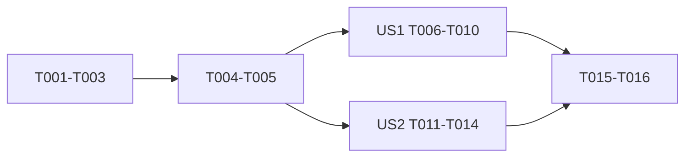

# Tasks: Series Learning Paths Frontend

## Phase 1: Setup

- [x] T001 Add series API/domain types and mapping in `src/features/series/series.types.ts` and `src/features/series/series.service.ts`
- [x] T002 [P] Add transport methods and service tests in `src/features/series/series.api.ts` and `src/features/series/series.service.test.ts`
- [x] T003 [P] Add the feature-local dependency factory in `src/features/series/series.dependencies.ts`

## Phase 2: Foundational

- [x] T004 Add failure-safe local visited progress and tests in `src/features/series/series.progress.ts` and `src/features/series/series.progress.test.ts`
- [x] T005 Add public and owner state hooks in `src/features/series/usePublicSeries.ts`, `src/features/series/useSeriesContext.ts`, and `src/features/series/useOwnerSeries.ts`

## Phase 3: User Story 1 - Public series reading

**Independent test**: A reader opens a public series, sees ordered parts and local progress, and navigates adjacent parts from a member blog while article rendering survives series failure.

- [x] T006 [P] [US1] Add public page/context component tests in `src/features/series/components/SeriesPartList.test.tsx` and `src/features/series/components/SeriesContextCard.test.tsx`
- [x] T007 [US1] Implement public series components in `src/features/series/components/SeriesPartList.tsx` and `src/features/series/components/SeriesContextCard.tsx`
- [x] T008 [US1] Implement the public route page and thin wrapper in `src/features/series/pages/SeriesPage.tsx` and `src/pages/Series.tsx`
- [x] T009 [US1] Integrate failure-isolated series context in `src/features/blog/pages/BlogDetailPage.tsx`
- [x] T010 [US1] Register `/series/:slug` in `src/Routes.tsx` and extend reader regression coverage in `src/features/blog/pages/BlogDetailPage.performance.test.tsx`

## Phase 4: User Story 2 - Owner management

**Independent test**: An author creates, edits, deletes, adds, removes, and reorders series blogs, then selects zero or one series before publishing.

- [x] T011 [P] [US2] Add owner management component/service tests in `src/features/series/components/SeriesManager.test.tsx` and `src/features/series/series.service.test.ts`
- [x] T012 [US2] Implement accessible owner management in `src/features/series/components/SeriesManager.tsx` and `src/features/series/pages/ManageSeriesPage.tsx`
- [x] T013 [US2] Add the thin route wrapper and protected `/series/manage` route in `src/pages/ManageSeries.tsx` and `src/Routes.tsx`
- [x] T014 [US2] Add series selection and membership persistence to `src/features/editor/pages/PublishBlogPage.tsx`

## Phase 5: Delivery

- [x] T015 Update route/reader/editor design docs in `docs/agent-guides/project-reference.md`, `design-system/pages/reader.md`, and `design-system/pages/editor.md`
- [ ] T016 Run focused tests, `yarn tsc --noEmit`, `yarn lint`, `yarn build`, responsive/accessibility review, and record results in `specs/015-series-learning-path/quickstart.md`

## Dependencies

## Parallel opportunities

- Transport and progress tests touch separate files.
- Public component tests and owner component tests can be prepared after the shared service contract stabilizes.

## MVP

Both public reading and owner management are required for the approved end-to-end feature.
