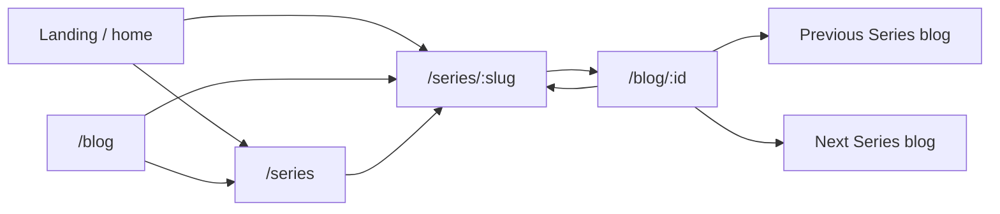
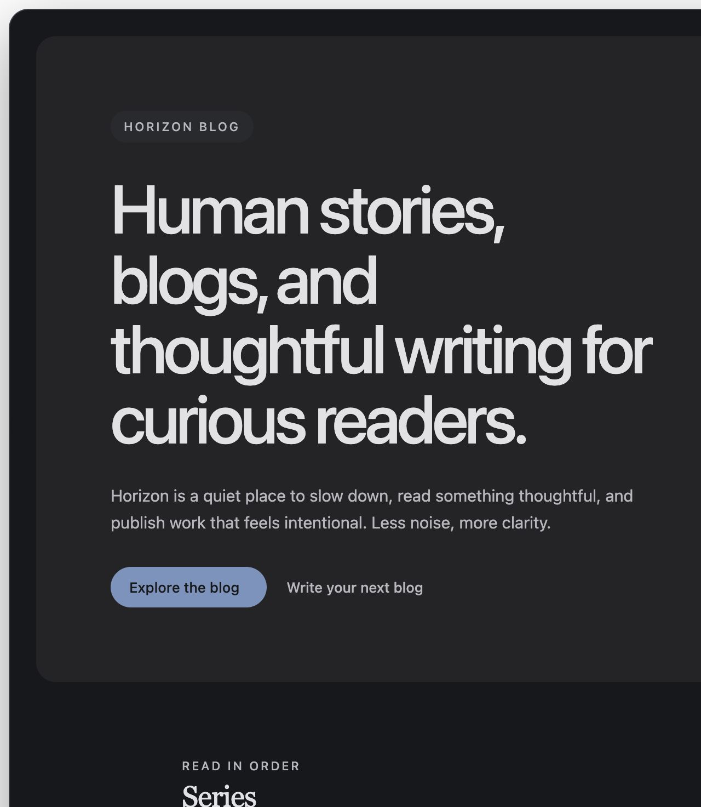
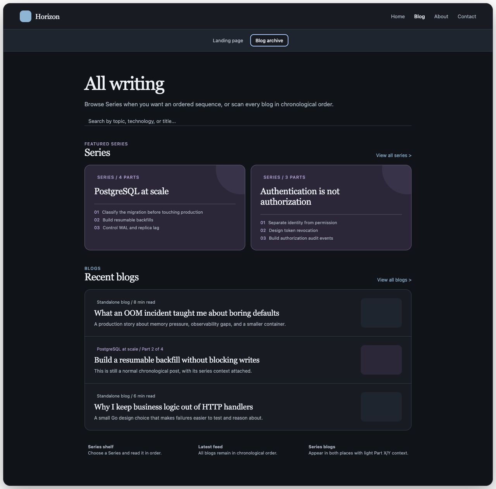
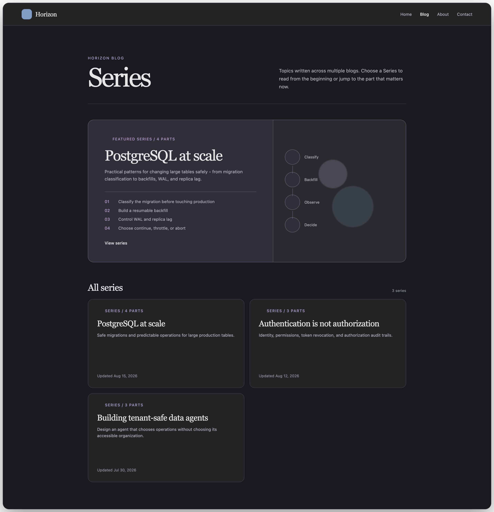
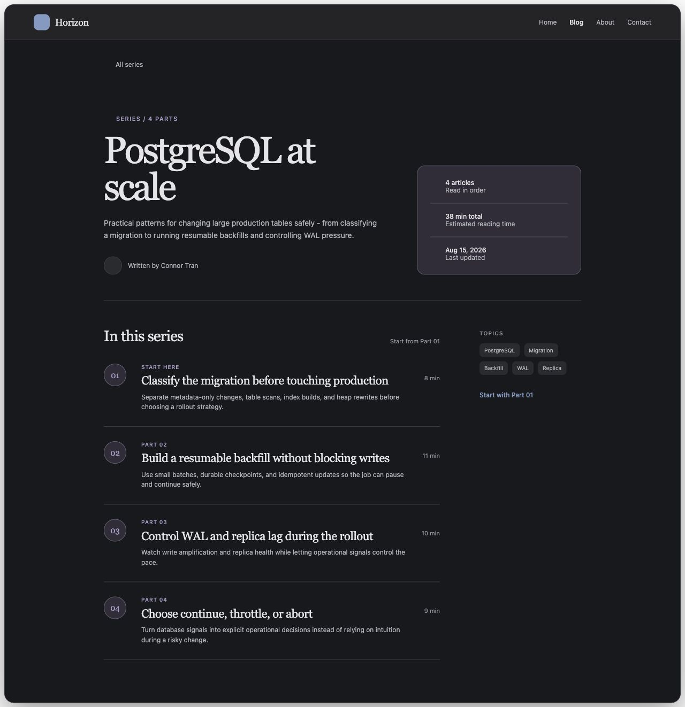
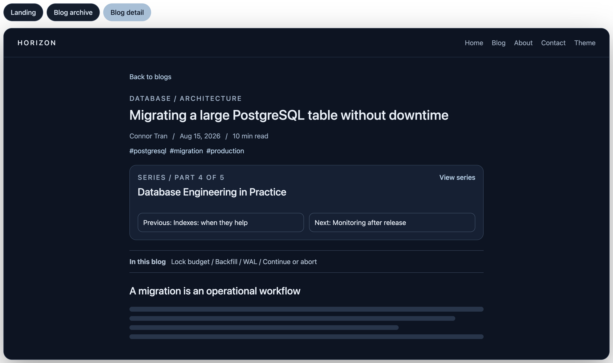
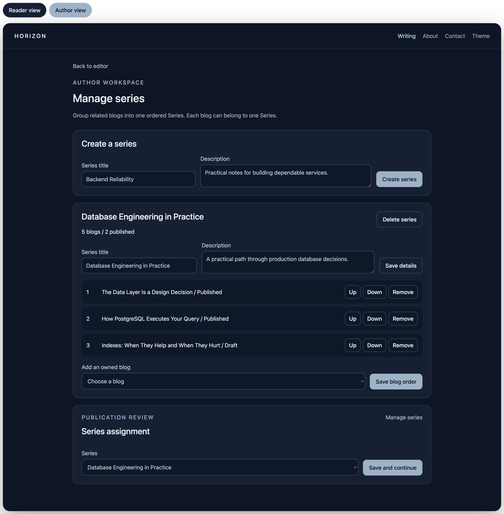

# Approved UI/UX: Series

**Status**: Approved for implementation
**Updated**: 2026-08-16
**Scope**: Public discovery, public Series detail, blog-reader context, owner management, and publication assignment.

## Product language

- Use **Series** as the public product term.
- Use `Part X of Y` for a blog's position inside a Series.
- Use `blogs`, `read`, `recent blogs`, and `in this series` elsewhere.
- Do not use `learning path`, `collection`, `course`, `lesson`, `enrollment`, or completion language in public UI.
- Do not show browser-local `Opened`, progress bars, completion percentages, or read-state checkmarks.

## Information architecture

The existing navbar remains unchanged. Series discovery lives in the reading surfaces until the content volume justifies a permanent top-level navigation item.

## Screen 1: Landing placement

Rules:

- Preserve the existing premium hero and its Latest Blog preview unchanged.
- Place the Series shelf immediately after the hero and before Recent Blogs.
- Show at most two recently updated public Series.
- Each Series card shows title, description, published part count, and a clear link target.
- `View all series` navigates to `/series`.
- Recent Blogs remains chronological and still contains both standalone blogs and blogs that belong to a Series.
- A Series-member blog adds light `Series title / Part X of Y` context; a standalone blog keeps the normal card treatment without a redundant `Standalone` badge.
- If Series loading fails or no public Series exists, omit the shelf and leave the hero and Recent Blogs unchanged.

## Screen 2: Blog archive placement

Rules:

- Preserve `BlogArchiveHero`, search, tag filters, featured blog, blog cards, and pagination.
- On the default unfiltered first page, place a compact Series shelf after the archive hero and before the normal blog results.
- Hide the shelf while a search, tag filter, or later results page is active so result intent remains dominant.
- The blog feed remains chronological and does not split into separate standalone and Series sections.
- Shelf failure is non-blocking and must not change blog result loading or error behavior.

## Screen 3: Public Series index

Route: `/series`

Hierarchy:

1. Compact `Series` page introduction.
2. One featured Series using the first item from the backend's deterministic public ordering.
3. `All series` responsive grid.
4. Standard pagination only when the public result set exceeds one page.

Card content:

- Series title and description.
- Published part count.
- Author and last-updated metadata when available.
- Entire card is a keyboard-accessible link to `/series/:slug` with visible focus.

States:

- **Loading**: content-shaped skeletons preserving the featured and grid layout.
- **Empty**: one calm sentence and one link back to `/blog`; do not show an empty featured slot.
- **Transient error**: retry plus a link back to `/blog`.
- **Not found**: not applicable to the index route.

## Screen 4: Public Series detail

Route: `/series/:slug`

Hierarchy:

1. `All series` back link.
2. Series label, title, description, author, published part count, total estimated reading time, and last-updated date.
3. Ordered `In this series` list with stable two-digit numbering.
4. Optional topic summary derived from public member-blog tags.

Each part shows:

- `Start here` for Part 01, otherwise `Part XX`.
- Blog title.
- Short plain-text excerpt.
- Estimated reading time.
- One full-row link to the existing public blog route.

The page does not expose draft/scheduled members or reading completion state. One-part Series remain valid and simply render one item.

States:

- **Loading**: header and ordered-list skeletons.
- **404/private/empty**: `Series unavailable` plus links to `/series` and `/blog`.
- **Transient error**: retry without losing the surrounding app shell.

## Screen 5: Blog reader Series context

On a member blog, `SeriesContextCard` remains between title/metadata/tags and the article table of contents/content. It shows:

- Series title linking to `/series/:slug`.
- `Part X of Y`.
- Previous and next public Series blogs when present.

The article request and rendering remain independent. Missing or failed Series context renders no helper card and never blocks content, comments, analytics, reactions, related blogs, sharing, or normal navigation.

## Screen 6: Owner management and publishing

Existing owner flows remain in scope:

- `/series/manage` supports create, rename, description editing, delete confirmation, membership selection, and explicit ordering.
- Publication review provides `No series` plus the author's owned Series and a `Manage series` link.
- Owner failures preserve the last confirmed server state and expose retryable feedback.
- Owner UI may show draft/scheduled/published status because it is a protected management surface.

## Responsive and accessibility contract

- Validate at 375px, 768px, 1024px, and 1440px.
- Stack multi-column Series layouts on mobile without horizontal overflow.
- Preserve visible focus in light and dark modes.
- Do not rely on color alone for Series membership or navigation state.
- Use semantic links for navigation and buttons only for actions.
- Keep reader and Series pages nearly static after loading; respect reduced motion.

## SEO and sharing contract

- `/series` and public `/series/:slug` are indexable public pages, not private SPA-only routes.
- Both routes need canonical URLs, title, description, Open Graph metadata, and sitemap coverage.
- Missing/private/empty Series remain real `404` responses for crawlers.
