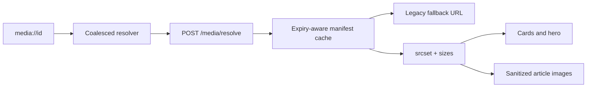

# Implementation Plan: Responsive Media Delivery

**Branch**: `agent/responsive-media-delivery`
**Spec**: [spec.md](./spec.md)
**Backend counterpart**: [../../../horizon-blog-be/specs/011-responsive-media-delivery/plan.md](../../../horizon-blog-be/specs/011-responsive-media-delivery/plan.md)
**Constitution**: [.specify/memory/constitution.md](../../.specify/memory/constitution.md)

## Technical Context

- **Stack**: React 18, TypeScript, Chakra UI, Marked 17, DOMPurify, Vitest.
- **Architecture**: Extend the media API adapter and hooks; keep transport DTOs out of card/reader components.
- **Compatibility**: Preserve `resolveMediaUrls(): Record<id, url>` for editor and legacy consumers; add typed manifest resolution beside it.
- **Performance**: Microtask coalescing, in-flight deduplication, expiry-aware memory cache, `srcset`, `sizes`, lazy loading, async decoding.
- **Dependencies**: No new frontend production dependency.
- **Validation**: Focused API/hook/reader tests, type check, lint, full tests, and production build.

## Constitution Check

- **Spec-first behavior**: Pass. Responsive selection, batching, fallback, and failure isolation are testable.
- **Contract alignment**: Pass. New fields are additive and the legacy resolver remains available.
- **Architecture**: Pass. Mapping and side effects remain in the media feature rather than render paths.
- **Design system**: Pass. Existing cards and reader layout remain visually unchanged.
- **Focused verification**: Pass. Shared resolver and reader changes justify full static/build gates.

## Loaded Agent Guides

- `docs/agent-guides/workflow.md`
- `docs/agent-guides/architecture.md`
- `docs/agent-guides/domain.md`
- `docs/agent-guides/design-system.md`
- `docs/agent-guides/project-reference.md`
- `design-system/MASTER.md`
- `design-system/components/README.md`
- `design-system/pages/home.md`
- `design-system/pages/blog.md`
- `design-system/pages/reader.md`
- `design-system/pages/editor.md`

## Phase 0: Research

See [research.md](./research.md).

## Phase 1: Design and Contract

- State model: [data-model.md](./data-model.md)
- UI contract: [contracts/media-delivery.md](./contracts/media-delivery.md)
- Verification guide: [quickstart.md](./quickstart.md)

## Delivery Architecture

## Implementation Boundaries

1. Add additive DTO/domain manifest types and defensive mapping.
2. Add a coalescing resolver with request chunking, in-flight sharing, and expiry-aware cache.
3. Keep the legacy URL-only resolver as a wrapper over the typed resolver.
4. Return responsive source data from cover and markdown hooks without changing stored tokens.
5. Add a shared responsive image prop helper and integrate hero/card/profile/editor surfaces according to priority.
6. Teach the reader renderer/sanitizer to emit only safe responsive image attributes.
7. Run focused and full verification and record actual results.

## Risks and Mitigations

- **Shared resolver regression**: Lock the legacy return shape with tests and keep it as an adapter.
- **Editor regression**: Editor consumers continue using URL-only resolution.
- **Signed URL expiry**: Cache lifetime uses the earliest URL expiry with a safety margin.
- **Batch starvation**: Flush once per microtask and chunk to the backend limit.
- **Unsafe HTML**: Continue DOMPurify allowlists; add only explicit image attributes.
- **Hero LCP regression**: Hero remains eager/high-priority while all repeated cards stay lazy.

## Post-Design Constitution Check

- Existing media identity and editor contracts remain intact.
- Reader sanitization remains restrictive.
- No new frontend dependency or visual paradigm is introduced.
- Backend encoder dependency approval is tracked by the backend plan.
