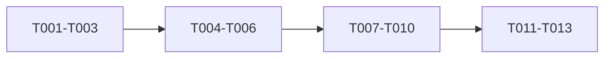

# Tasks: Responsive Media Delivery Frontend

## Phase 1: Contract and tests

- [x] T001 Add additive media DTO/domain types and defensive mapping tests in `src/features/media/media.api.ts` and `src/features/media/media.api.test.ts`
- [x] T002 Add failing batching, chunking, in-flight deduplication, and expiry-cache tests in `src/features/media/media.api.test.ts`
- [x] T003 Add responsive markdown and presentation tests in `src/features/media/useResolvedMarkdown.test.ts` and `src/features/media/media.presentation.test.ts`

## Phase 2: Shared resolver

- [x] T004 [US2] Implement typed manifest mapping and expiry-aware cache in `src/features/media/media.api.ts`
- [x] T005 [US2] Implement microtask coalescing, deduplication, and bounded chunking in `src/features/media/media.api.ts`
- [x] T006 [US3] Preserve the URL-only resolver wrapper for editor/profile compatibility in `src/features/media/media.api.ts`

## Phase 3: Responsive rendering

- [x] T007 [US1] Add responsive source helpers in `src/features/media/media.presentation.ts` and extend cover resolution in `src/features/media/useResolvedCoverImage.ts`
- [x] T008 [US1] Extend markdown resolution to retain media manifests without changing persisted tokens in `src/features/media/useResolvedMarkdown.ts`
- [x] T009 [US1] Render and sanitize responsive article images in the active Milkdown reader and `src/components/reader/MarkdownReader.tsx`
- [x] T010 [US1] Apply hero/card loading priorities and responsive props in home/blog/profile/editor cover surfaces

## Phase 4: Delivery

- [x] T011 Run focused tests and fix regressions
- [x] T012 Run type check, lint, full tests, and production build
- [x] T013 Record verification results in `specs/016-responsive-media-delivery/quickstart.md`

## Dependencies

## MVP

T001-T013 are required because responsive backend variants have no reader value until batching, fallback, and browser selection are integrated safely.
