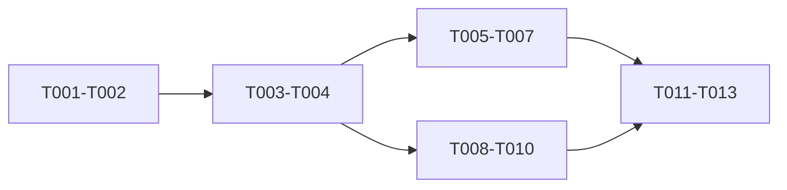

# Tasks: Analytics Insight Redesign

## Phase 1: Contract and regression coverage

- [x] T001 Capture approved page IA, behavior, accessibility, and non-goals in the feature spec and analytics design-system page.
- [x] T002 Add failing helper tests for reader-journey derivation, reach/depth positions, and contextual evidence sections.

## Phase 2: Shared analytics primitives

- [x] T003 Implement tested analytics display helpers without changing API DTOs.
- [x] T004 Build the shared accessible tooltip and compact UTC date-range control.

## Phase 3: Overview

- [x] T005 Build the aggregate reader journey.
- [x] T006 Build the accessible reach × completion map and selected-blog evidence strip.
- [x] T007 Replace overview scorecards/table while preserving loading, errors, empty state, range, and pagination.

## Phase 4: Detail

- [x] T008 Build question tabs and retention, source, and action diagnostics.
- [x] T009 Build the contextual evidence rail with duplicate suppression.
- [x] T010 Replace detail dashboard composition while preserving route, range, freshness, and empty state.

## Phase 5: Delivery

- [x] T011 Update analytics component/page documentation.
- [x] T012 Run focused tests and resolve regressions.
- [x] T013 Run type check, scoped lint, production build, and record verification evidence.

## Dependencies

