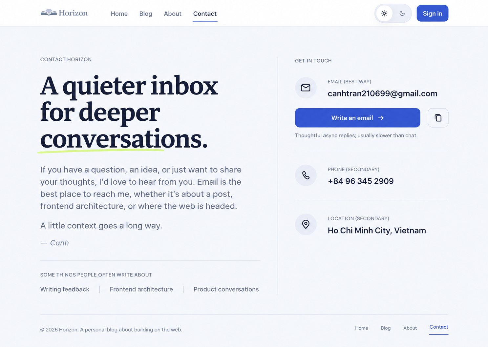

# Feature Specification: Contact Editorial Letter

**Feature Branch**: `codex/epic-horizon-blog-dsv2`  
**Created**: 2026-09-15  
**Status**: Implemented and verified
**Input**: Redesign `/contact` from the selected Editorial Letter direction, fix the verified narrow-mobile defects, and keep direct contact honest and accessible without adding a form.

## Decision Summary

The selected direction is **Editorial Letter**: a personal invitation on the left and a compact contact rail on the right. Email is the only primary action. Phone and location are secondary. Repetitive reason cards are replaced by a short inline topic list.

The redesign MUST stay inside Horizon's Signal design language and existing design-system contracts. The reference image defines hierarchy, proportion, and visual intent; this specification defines behavior, content, responsiveness, and accessibility when the two differ.

### Authority Order

When sources disagree, use this order:

1. This specification for product behavior, approved content, responsive behavior, and acceptance criteria.
2. `DESIGN.md` and semantic tokens under `src/theme/tokens/` for the Signal visual system.
3. The approved reference image for layout, emphasis, density, and composition.
4. Existing `/contact` behavior for preserved contact values and link semantics.

The generated image is directional, not a request to copy pixels, create raw values, or reproduce accidental image artifacts.

## Problem Statement

The current Contact page has a strong editorial foundation, but the reviewed implementation has four concrete problems:

1. At a 320px viewport, the shared header compresses `Sign in` onto two lines.
2. At the same width, `canhtran210699@gmail.com` breaks arbitrarily between `.c` and `om`, damaging the page's primary contact value.
3. The intro, email helper copy, and three-item reasons section repeat the same writing/frontend/context message, making a simple contact task unnecessarily long.
4. The email uses a hover-only underline and otherwise reads like oversized text, so its interactive affordance is weaker on touch devices.

The redesign should make a visitor feel invited, show the preferred channel immediately, and keep the entire main contact experience compact without becoming a sales page or support form.

## User Scenarios & Testing

### User Story 1 - Start a thoughtful email (Priority: P1)

As a reader who wants to contact the author, I want to identify the preferred email channel and act on it immediately so that I can continue the conversation outside the blog.

**Why this priority**: Direct email is the reason the page exists and is explicitly the preferred channel.

**Independent Test**: Open `/contact` at 1440x1024 and 390x844. Confirm the email value, `Write an email` action, response expectation, and copy action appear before phone and location.

**Acceptance Scenarios**:

1. **Given** a visitor opens `/contact`, **When** the page becomes visible, **Then** the invitation and preferred email channel are the strongest content and action.
2. **Given** the visitor activates `Write an email`, **When** the browser handles the link, **Then** it uses `mailto:canhtran210699@gmail.com` in the same browsing context.
3. **Given** the visitor activates the copy control, **When** clipboard writing succeeds, **Then** the exact email address is copied and a visible, politely announced success state appears.
4. **Given** clipboard writing is unavailable or fails, **When** the visitor activates copy, **Then** the email remains selectable/readable and an accessible failure state is shown without navigation or data loss.

### User Story 2 - Understand the invitation (Priority: P1)

As a reader deciding whether to reach out, I want a short personal note and examples of useful topics so that I know what kind of conversation is welcome without reading repetitive cards.

**Why this priority**: The selected direction is intentionally personal and editorial; copy and structure carry that character.

**Independent Test**: Read the left column or stacked mobile intro and confirm it contains one invitation, one expectation sentence, one author sign-off, and a compact topic list with no separate reason-card section.

**Acceptance Scenarios**:

1. **Given** a visitor reads the introduction, **When** they scan the page, **Then** the language feels personal, calm, and authored rather than corporate, support-oriented, or sales-oriented.
2. **Given** the visitor wants examples, **When** they reach the topic list, **Then** writing feedback, frontend architecture, and product conversations are presented once in a compact form.
3. **Given** the main content is complete, **When** the visitor reaches the contact rail, **Then** no contact form, promotional card grid, testimonial, or redundant reason section appears.

### User Story 3 - Use secondary contact information (Priority: P2)

As a visitor who cannot or should not use email, I want to find the phone number and location without them competing with the preferred channel.

**Why this priority**: These details are useful but must not dilute email's priority.

**Independent Test**: Scan the contact rail and confirm phone and location use quieter rows beneath email with clear labels and dividers.

**Acceptance Scenarios**:

1. **Given** the visitor selects the phone number or its action, **When** it is activated, **Then** it uses `tel:+84963452909`.
2. **Given** the visitor reads the location, **When** no approved destination exists, **Then** `Ho Chi Minh City, Vietnam` renders as text without an invented map link or dead control.
3. **Given** the page is viewed in either theme, **When** secondary rows are compared with the email area, **Then** their lower emphasis remains readable and does not rely on color alone.

### User Story 4 - Use the page at narrow widths and with a keyboard (Priority: P1)

As a visitor on a narrow screen or using a keyboard, I want the page and shared header to reflow without broken words, hidden actions, or unclear focus.

**Why this priority**: The current implementation has verified defects at 320px, and the route must meet the design-system small-screen and keyboard contract.

**Independent Test**: Exercise `/contact` at 320x800, 375x812, 768x1024, 1024x768, and 1440x1024 in light and dark themes, then traverse all interactive elements by keyboard.

**Acceptance Scenarios**:

1. **Given** a 320px-wide viewport, **When** the header renders, **Then** `Sign in` remains on one line and no header control overlaps, clips, or falls below its 44px target.
2. **Given** a 320px-wide viewport, **When** the email renders, **Then** the domain is not split arbitrarily and no horizontal scrolling is introduced.
3. **Given** a viewport below the two-column threshold, **When** the layout reflows, **Then** the invitation appears first and the contact rail follows as one logical stack.
4. **Given** keyboard navigation, **When** focus advances through the page, **Then** the skip link, header controls, email action, copy control, phone action, and footer links receive a visible focus state in logical order.
5. **Given** the mobile menu is open, **When** the visitor activates its trigger again, selects a navigation item, or presses Escape, **Then** the menu closes and focus remains predictable.

## Approved Content Contract

Implementation copy MAY receive minor grammar or line-length edits during planning, but its meaning and hierarchy MUST remain:

- Eyebrow: `Contact Horizon`
- Headline: `A quieter inbox for deeper conversations.`
- Invitation: `If you have a question, an idea, or just want to share your thoughts, I'd love to hear from you. Email is the best place to reach me, whether it's about a blog, frontend architecture, or where the web is headed.`
- Expectation: `A little context goes a long way.`
- Sign-off: `- Canh`
- Topic label: `Some things people often write about`
- Topics: `Writing feedback`, `Frontend architecture`, `Product conversations`
- Rail label: `Get in touch`
- Email label: `Email (best way)`
- Email value: `canhtran210699@gmail.com`
- Primary action: `Write an email`
- Email helper: `Thoughtful async replies; usually slower than chat.`
- Phone label: `Phone (secondary)`
- Phone value: `+84 96 345 2909`
- Location label: `Location (secondary)`
- Location value: `Ho Chi Minh City, Vietnam`

Use an ASCII hyphen for the source sign-off unless the existing repository formatter and copy conventions already support a typographic dash in that file.

## Requirements

### Functional Requirements

- **FR-001**: `/contact` MUST contain no form fields, submit action, form validation, contact endpoint, or fake sending state.
- **FR-002**: The page MUST present one primary `mailto:` action for `canhtran210699@gmail.com` with the visible label `Write an email`.
- **FR-003**: The email address MUST have a dedicated copy control with idle, busy when applicable, success, and failure behavior.
- **FR-004**: Copy success and failure MUST be visible and announced through an appropriate live region; a color or icon change alone is insufficient.
- **FR-005**: The page MUST present `+84 96 345 2909` as the secondary telephone channel with `tel:+84963452909` semantics.
- **FR-006**: `Ho Chi Minh City, Vietnam` MUST remain informational text unless a real destination is separately approved.
- **FR-007**: The existing route, app-shell behavior, authentication behavior, theme selection, and contact values MUST remain unchanged.
- **FR-008**: The redesign MUST not add backend/API behavior or production dependencies.

### Layout and Visual Requirements

- **VR-001**: At desktop widths, the main content MUST use an asymmetrical two-column editorial composition: invitation on the left, contact rail on the right, separated by spacing and at most one subtle divider.
- **VR-002**: The headline MUST be expressive but smaller and denser than the current full-width display headline so the preferred contact action remains visible in the first desktop viewport.
- **VR-003**: The email action MUST be the strongest interactive treatment and use `action.*` semantic roles; lime/accent treatment is decorative and limited to one restrained mark.
- **VR-004**: Phone and location MUST render as quiet rows with consistent label, value, icon, and divider alignment rather than separate promotional cards.
- **VR-005**: The separate three-column `A few helpful reasons to reach out` section MUST be removed and replaced by the approved inline topic list.
- **VR-006**: The page MUST use existing semantic tokens and design-system primitives. It MUST introduce no raw color, spacing, radius, shadow, typography, or motion values.
- **VR-007**: The page MUST render coherently in paired light and dark themes.
- **VR-008**: Resting states MUST communicate clickability without requiring hover.
- **VR-009**: The main contact experience SHOULD fit within a 1440x1024 viewport, including the start of the shared footer; essential contact content MUST fit even if the existing footer extends below it.

### Responsive Requirements

- **RR-001**: The layout MUST be checked at 320, 375, 768, 1024, and 1440 CSS pixels.
- **RR-002**: At narrow widths, columns MUST become one stack in reading order: invitation, topics, email, phone, location.
- **RR-003**: The email MUST not break inside `gmail.com`. If a break is unavoidable, it MUST occur at an intentional semantic opportunity such as after `@`, with the accessible name remaining the full address.
- **RR-004**: The shared header MUST not depend on flex shrinking text. At 320px, `Sign in` MUST remain a single-line readable action; the implementation plan MAY move it into the expanded menu or choose another existing compact composition.
- **RR-005**: The page MUST have no horizontal overflow at 320px or at 200% browser zoom on the desktop test surface.
- **RR-006**: Interactive targets MUST be at least 44x44 CSS pixels where the design-system control contract applies.

### Accessibility Requirements

- **AR-001**: Preserve one `h1`, logical section headings, the `main` landmark, working skip link, and current-page navigation semantics.
- **AR-002**: Text contrast MUST meet WCAG AA for its rendered size in both themes; focus indicators and interactive boundaries MUST reach at least 3:1 against adjacent colors.
- **AR-003**: The copy control MUST have an accessible name such as `Copy email address`; its state announcement MUST not steal focus.
- **AR-004**: Icons MUST be decorative when adjacent text already provides the name.
- **AR-005**: The primary action, copy action, and phone action MUST each have one clear purpose and avoid duplicate tab stops to the same destination.
- **AR-006**: Motion MUST be limited to existing reveal/control feedback and MUST respect reduced-motion preferences.

### Design-System Discovery Requirements

- **DS-001**: Before creating or customizing reusable UI, the implementing agent MUST start Storybook and use `docs-list`, `docs-show`, and `docs-show-story` for candidate components.
- **DS-002**: Candidate existing primitives include `ActionLink`, `IconButton`, `ContentContainer`, `Section`, `Grid`, `Stack`, `Heading`, `Text`, `Eyebrow`, `Divider`, and the `ContactCard` pattern.
- **DS-003**: If the required contact-rail behavior is absent from the Storybook MCP pilot, the agent MUST inspect the `ContactCard` gallery states in `ui-kit.html` and document the capability gap before adding a component.
- **DS-004**: A new global design-system component MUST NOT be created merely because the selected reference has a new arrangement. Prefer composition or a feature-owned Contact component unless reusable behavior is genuinely missing.
- **DS-005**: If a new or materially changed design-system component is approved, its Storybook stories MUST cover light, dark, narrow width, long email content, keyboard focus, copy success, and copy failure as applicable.

### Documentation Requirements

- **DOC-001**: The implementation MUST update `design-system/pages/contact.md`; its current form-shell, form-control, `ContactInfoCard`, and `ContactPromptCard` guidance is stale and conflicts with the approved direct-contact experience.
- **DOC-002**: `design-system/component-inventory.md` MUST be updated if the final component ownership or page composition differs from its current `ContactCard`/`ContactPrompt` mapping.
- **DOC-003**: Do not edit historical `specs/004-redesign-contact-direct/spec.md`; this specification supersedes its visual composition while preserving its no-form decision.

## Scope Boundaries

### In Scope

- `/contact` composition, content, and direct-contact interactions.
- A narrowly scoped shared-navbar responsive adjustment required to fix the verified 320px header defect.
- Feature-owned copy-email state and tests, unless planning proves an existing reusable implementation is the correct owner.
- Contact design documentation and component-inventory alignment.
- Targeted Storybook/gallery coverage when a shared design-system contract changes.

### Conditional Scope

- A shared-footer responsive adjustment is permitted only if planning proves it is necessary to meet the selected compact-page direction. Any shared-footer change must be separately identified and regression-checked on representative public and protected routes.

### Non-Goals

- Reintroducing a contact form.
- Adding a contact API, persistence, analytics, authentication, or authorization behavior.
- Changing the route or navigation information architecture.
- Adding a map link or geolocation behavior without a separately approved destination.
- Redesigning unrelated pages.
- Replacing Chakra, React Router, Storybook, the app shell, or the design-system token model.
- Adding a new production dependency.
- Implementing the feature as part of this specification task.

## Planning Constraints for Claude Code

The implementation plan MUST:

1. Inspect the existing `ContactPage`, `Navbar`, contact pattern, copy/clipboard patterns, tests, Storybook MCP catalog, and gallery state before choosing owners.
2. Separate the Contact page composition change from any shared Navbar or Footer change so shared-shell regression risk is explicit.
3. Identify whether copy behavior reuses an existing state pattern or needs a feature-owned implementation; do not silently couple Contact to reader/code-block domain components.
4. Define targeted tests before implementation for copy success/failure, link semantics, content removal, and narrow-width invariants.
5. Define a visual verification matrix covering both themes and all required widths, including the exact 320px reproduction.
6. Preserve unrelated worktree changes and avoid commits or pushes unless explicitly requested.

## Success Criteria

- **SC-001**: At 320x800, `Sign in` renders on one line, the email domain does not split, every required control remains at least 44px, and the document has no horizontal overflow.
- **SC-002**: At 390x844, the invitation and preferred email channel are encountered before phone and location, with the primary action clearly visible and keyboard reachable.
- **SC-003**: At 1440x1024, the page visibly matches the selected Editorial Letter hierarchy: invitation column, contact rail, one cobalt primary action, restrained lime accent, and no reason-card grid.
- **SC-004**: Email, phone, and location use the exact approved values and correct `mailto:`, `tel:`, and non-link semantics.
- **SC-005**: Copy success and failure are both tested and visibly/accessibly communicated.
- **SC-006**: Light and dark mode screenshots at 320, 375, 768, 1024, and 1440 show no overlap, clipping, arbitrary email break, or unreadable state.
- **SC-007**: Keyboard traversal confirms the skip link, mobile menu, primary email action, copy action, phone action, theme controls, and footer links have visible focus and logical order.
- **SC-008**: Targeted tests, TypeScript, lint, formatting, design-system coverage, and the production build pass after implementation.
- **SC-009**: Updated Contact design documentation no longer instructs agents to build a form or obsolete contact-card composition.

## Evidence and Verification Notes

The issue was reproduced against the running worktree at:

- Desktop: 1280x720; current layout is readable but vertically long.
- Mobile: 390x844; current layout reflows without horizontal overflow.
- Narrow mobile: 320x800; current header wraps `Sign in` and the email splits between `.c` and `om`.

The audit also confirmed the existing page has a working skip link, logical landmarks/headings, `aria-current="page"`, 44px primary touch targets, light-label contrast of 5.04:1, functioning light/dark selection, and no observed browser-console errors. These strengths MUST not regress.

## Assumptions

- The current email, phone number, location, and no-form decision remain correct.
- The selected reference is the approved visual direction; the specification remains authoritative where responsive behavior or design-system contracts differ from the generated image.

## Implementation Evidence

- Implemented in the feature-owned `ContactRail` and the `/contact` page composition without a new production dependency or global design-system component.
- Storybook MCP discovery confirmed the Contact rail is outside the six-component pilot catalog; the capability gap is recorded in `design-system/storybook-mcp.md`.
- `design-qa.md` records light/dark checks at 320, 375, 768, 1024, and 1440, keyboard traversal, copy feedback, and final automated gates.
