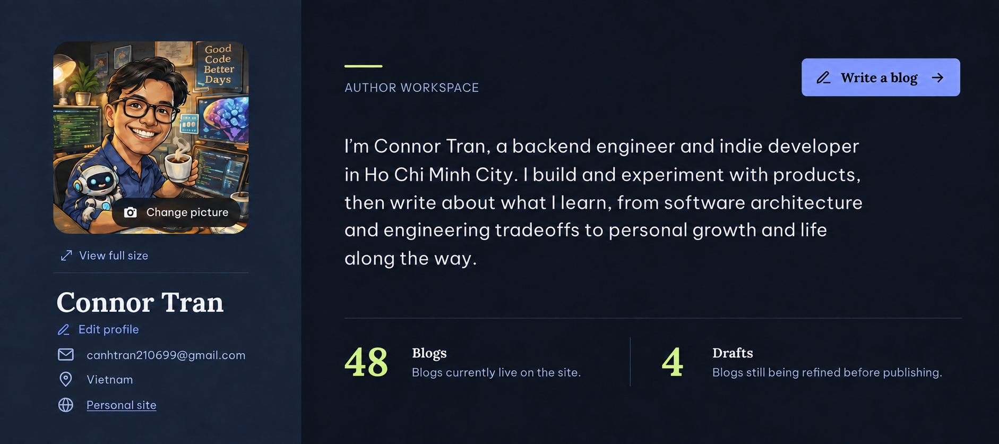

# Feature Specification: Profile Editorial Workspace

**Feature Branch**: `codex/epic-horizon-blog-dsv2`
**Created**: 2026-09-16
**Status**: Complete
**Input**: Recompose the protected author profile from the approved split editorial workspace reference without changing profile, avatar, authorization, or owned-blog behavior.

## Decision Summary

The selected direction is a two-part editorial workspace: an identity rail on the left and a writing-focused content area on the right. `Write a blog` is the only dominant action. `Edit profile` is a quiet text action immediately below the author's name.

### Authority Order

1. This specification for behavior, responsive rules, and accessibility.
2. `DESIGN.md`, `design-system/MASTER.md`, and semantic tokens.
3. The approved reference for layout, hierarchy, and density.
4. Existing profile behavior and backend contracts.

The generated reference is directional. Implementation must use Horizon tokens and components rather than raw pixel copies.

## User Outcome

As the signed-in owner, I can recognize my profile, manage my portrait and profile details, start writing, and understand live/draft counts without the page feeling like a dashboard.

## Requirements

### Functional

- Preserve current profile loading, editing, avatar upload, preview, authorization, and blog-count behavior.
- Keep `Write a blog` permission-gated by `content:manage:own`.
- Keep `Edit profile` available independently of the writing permission.
- Preserve the current edit-profile and avatar-preview modals.
- Add no backend contract, route, dependency, or persistence change.

### Visual and Layout

- Desktop uses one split `ProfileShell`: identity rail left, writing context right.
- The left rail contains the portrait editor, `View full size`, display name, inline `Edit profile`, email, location, and personal site.
- The right region contains `Author workspace`, the permission-gated `Write a blog` CTA, biography, a quiet divider, and Blogs/Drafts facts.
- The portrait is a large square media frame with the change-picture control overlaid inside its boundary.
- `Edit profile` is a text-style button with an edit icon; it must not compete with the primary CTA.
- Counts use semantic `dl` markup and typography/dividers instead of KPI cards.
- Use only existing semantic tokens, spacing, radii, type recipes, icons, and responsive breakpoints.
- The default/public `ProfileHeader` layout used by the author archive must not visually regress.

### Responsive and Accessibility

- At 320/375/768 widths, the workspace becomes one logical stack without horizontal overflow.
- At 1024/1440 widths, the split composition remains readable and the biography keeps a comfortable measure.
- The file input remains keyboard reachable through a named visible control.
- Avatar upload progress and failure remain visible and announced.
- Focus order is portrait actions, identity/profile action, contact links, primary writing action, then the owned-writing content below.
- All actions retain visible focus in both themes; text and boundaries meet the existing contrast contract.
- No new motion is required.

### Design-System Discovery

- The Storybook MCP pilot exposes only Button, Field, PostCard, MediaFrame, ErrorState, and NavItem; it does not expose ProfileHeader or AvatarEditor.
- Reuse the existing design-system `ProfileHeader`, `AvatarEditor`, `ActionLink`, `Button`, typography, layout, media, and divider primitives.
- Extend existing account patterns with an explicit workspace presentation; do not create a new global component.
- Add a gallery state for the workspace presentation because the Storybook pilot has a documented capability gap.

## Scope

### In Scope

- `ProfileHeader` workspace presentation.
- `AvatarEditor` workspace presentation.
- `ProfileHeaderCard` composition.
- Account-pattern/gallery tests and profile tests.
- Profile design documentation, inventory notes, and visual QA evidence.

### Non-Goals

- Redesigning the public author archive.
- Changing owned blog grids, scheduled rows, pagination, or editor flows.
- Changing API, auth, permission, modal, or upload behavior.
- Adding new tokens, fonts, icon packages, or production dependencies.
- Committing or pushing unless separately requested.

## Acceptance Criteria

1. The protected profile visibly matches the selected split hierarchy at desktop width.
2. `Edit profile` renders beneath the author's name as a low-emphasis text action.
3. `Write a blog` is the only dominant header CTA and remains permission-gated.
4. The portrait editor uses a square frame and clipped overlay action while keeping the accessible file input and error/loading states.
5. Blogs and Drafts remain semantic term/description pairs and no longer render as boxed KPI tiles in the workspace presentation.
6. The default `ProfileHeader` and `AvatarEditor` presentations remain unchanged for existing consumers.
7. Targeted tests, TypeScript, lint, formatting, design-system coverage, production build, and browser design QA pass.
